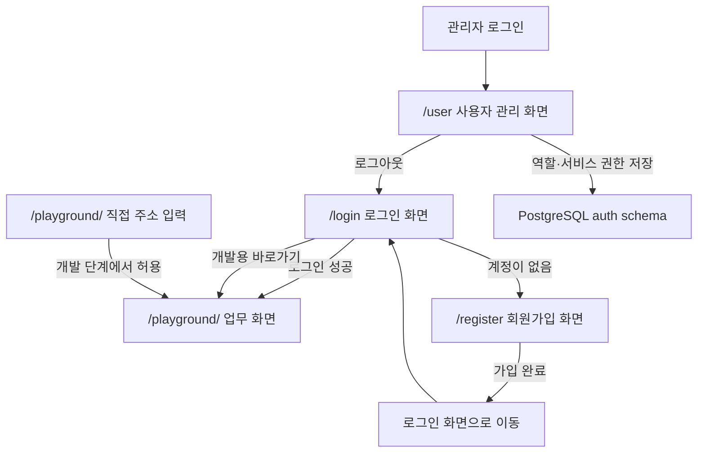
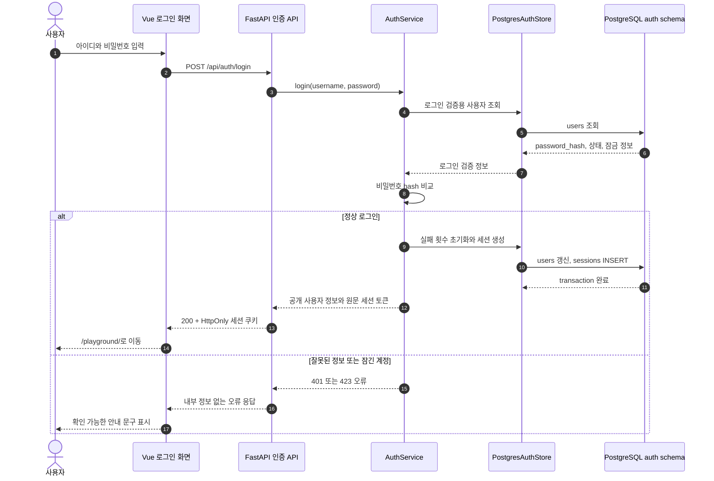
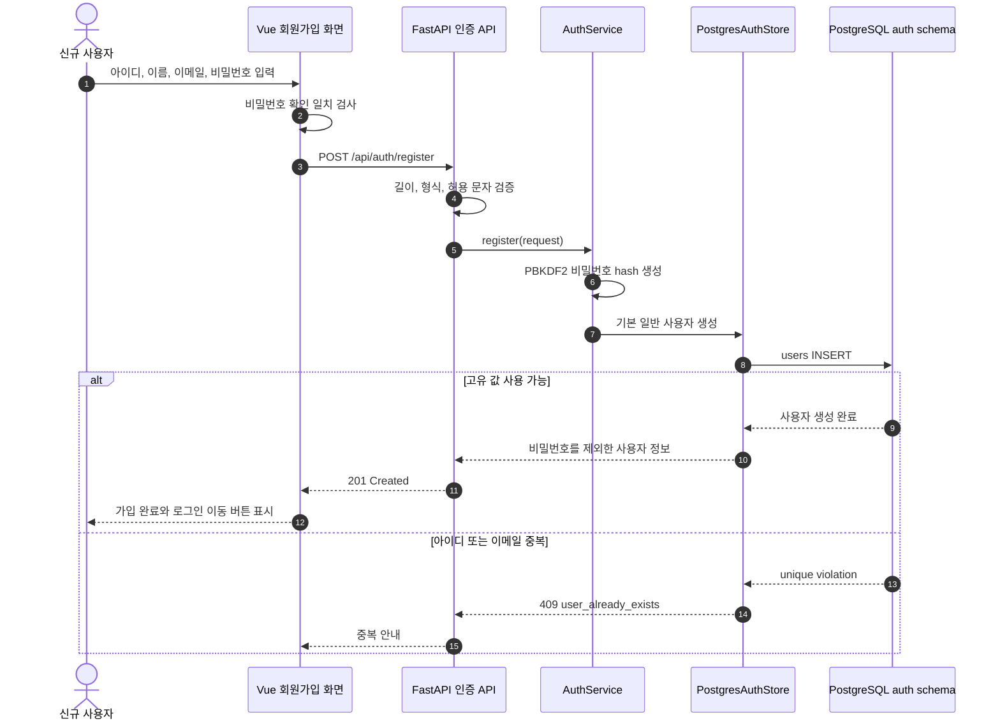
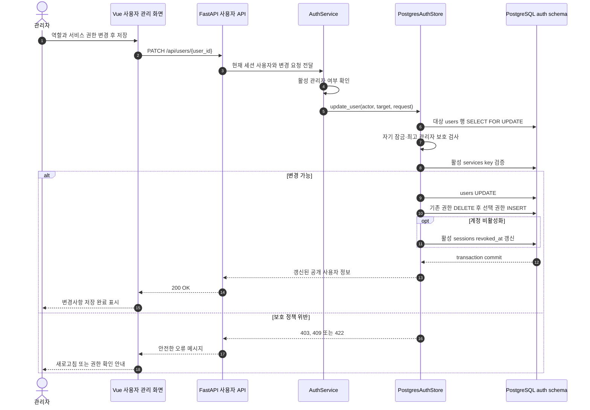
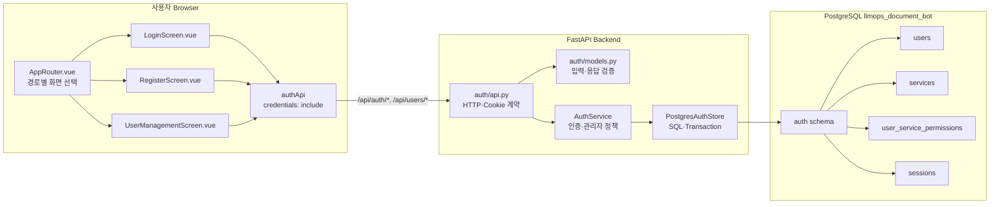
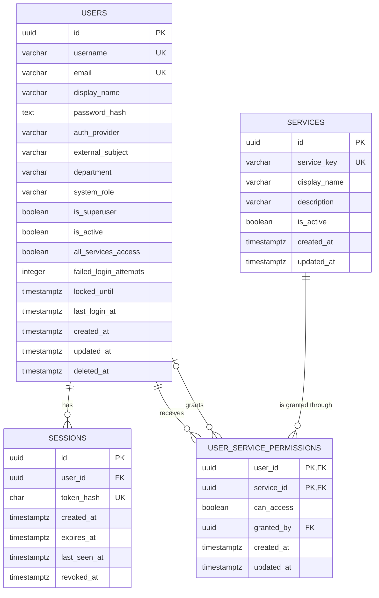
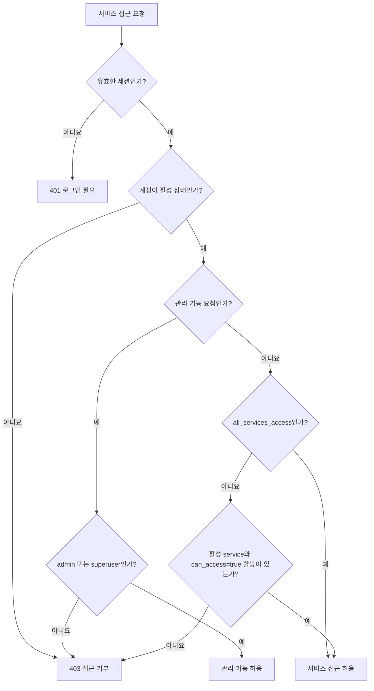

# 로그인·회원가입·사용자 권한 관리

- 기준일: 2026-08-07
- 상태: UI, FastAPI API, PostgreSQL `auth` schema 연동 완료
- 대상 독자: 서비스 사용자, 관리자, 개발·운영 담당자
- 대상 환경: 합성 데이터 전용 로컬 개발 환경

## 1. 문서 목적

이 문서는 다음 세 화면과 이를 지원하는 Backend·DB 구조를 한곳에서 설명한다.

| 화면 | 주소 | 주요 사용자 | 목적 |
|---|---|---|---|
| 로그인 | `http://127.0.0.1:5173/login` | 로컬·SeeLIS 사용자 | 로컬 또는 SeeLIS 아이디와 비밀번호로 로그인 |
| 회원가입 | `http://127.0.0.1:5173/register` | 신규 사용자 | 기본 권한이 없는 일반 계정 생성 |
| 사용자 관리 | `http://127.0.0.1:5173/user` | 관리자 | 역할, 계정 상태, 서비스 접근 권한 관리 |

로그인에 성공하면 `http://127.0.0.1:5173/playground/`로 이동한다. 사용자의 요청에 따라 개발 단계에서는
로그인하지 않고 `/playground/` 주소로 바로 접속하는 기존 흐름도 유지한다.

> **현재 권한 적용 범위**
>
> 계정·세션·역할·서비스 권한은 실제 PostgreSQL에 저장되고 사용자 관리 화면에서 변경된다. 다만 개발 중인 기존
> Playground 동작에 영향을 주지 않기 위해 `/playground/` 화면과 `/api/playground/*` API에는 아직 로그인·서비스 권한을
> 강제하지 않는다. 운영 전환 시 이 문서의 [운영 전 보완 항목](#16-운영-전-보완-항목)에 따라 권한 검사를 연결해야 한다.

## 2. 전체 사용자 흐름



일반적인 사용 순서는 다음과 같다.

1. 신규 사용자가 회원가입 화면에서 계정을 만든다.
2. 새 계정은 활성 상태지만 시스템 역할은 `user`, 서비스 접근 권한은 없음으로 시작한다.
3. 관리자가 사용자 관리 화면에서 필요한 서비스 권한을 부여한다.
4. 사용자가 로그인하면 서버가 발급한 세션 쿠키를 사용해 로그인 상태를 유지한다.
5. 관리자가 계정을 비활성화하면 해당 사용자의 활성 세션도 함께 취소된다.

## 3. 화면 공통 디자인

세 화면은 기존 Playground와 같은 `frontend/src/app.css` 디자인 토큰을 사용한다. 별도 서비스처럼 보이지 않으면서도
인증 기능은 독립된 전체 화면으로 구성한다.

| 항목 | 값 | 용도 |
|---|---|---|
| 배경 | `#f8f2f4` | Playground와 인증 화면의 기본 배경 |
| 패널 | `#ffffff` | 입력 폼과 사용자 목록 배경 |
| 강조색 | `#c21f3a` | 주요 버튼, 선택 상태, 포커스 |
| 진한 강조색 | `#97152c` | 링크, hover, 제목 보조색 |
| 약한 강조 배경 | `#fff0f3` | 배지, 아이콘, 선택 영역 |
| 기본 글자 | `#26171d` | 본문과 제목 |
| 보조 글자 | `#74616a` | 설명과 시간 정보 |
| 경계선 | `#e7d8dd` | 카드와 입력 필드 구분 |

로그인과 회원가입은 공통 `AuthShell.vue`를 사용한다.

- 왼쪽에는 제품명, 온프레미스 업무 공간 설명, 로그인 정보 비저장 안내를 표시한다.
- 오른쪽에는 실제 입력 폼을 배치한다.
- 좁은 화면에서는 열을 줄여 작은 화면에서도 입력 요소를 사용할 수 있게 한다.
- 키보드 포커스, `autocomplete`, 오류 `role="alert"`, 처리 중 버튼 비활성화를 적용한다.
- `prefers-reduced-motion` 환경에서는 불필요한 애니메이션 시간을 최소화한다.

## 4. 로그인 화면

### 4.1 구성

`/login` 화면은 로컬 계정을 기본 탭으로 제공하고, 같은 화면의 SeeLIS 계정 탭에서 외부 계정 로그인을 선택할 수 있다.
탭을 바꾸면 비밀번호와 이전 오류를 지워 다른 인증 방식으로 잘못 제출하지 않도록 한다.

화면은 다음 요소로 구성한다.

| 영역 | 기능 |
|---|---|
| 로그인 방식 | `로컬 계정`, `SeeLIS 계정` 탭을 키보드와 마우스로 선택 |
| 아이디 | 로컬 `username` 또는 SeeLIS `userId` 입력, 자동 대문자 변환과 맞춤법 검사 비활성화 |
| 비밀번호 | 입력 내용을 가려 표시하고 대소문자 구분 안내 제공 |
| 로그인 버튼 | 요청 중 중복 제출을 막고 `로그인 중` 상태 표시 |
| 오류 메시지 | 잘못된 계정 정보, 비활성 계정, 서버 연결 실패를 사용자용 문장으로 표시 |
| 회원가입 링크 | 로컬 계정 탭에서만 `/register`로 이동 |
| 개발용 바로가기 | 기존 동작 보존을 위해 `/playground/`로 직접 이동 |

### 4.2 처리 규칙

1. Frontend가 아이디 앞뒤 공백만 제거한 뒤 `POST /api/auth/login`을 호출한다.
2. Backend가 대소문자를 구분하지 않고 사용자를 찾는다.
3. 비밀번호 hash를 PBKDF2-HMAC-SHA256으로 다시 계산해 상수 시간 비교한다.
4. 계정 잠금과 활성 상태를 확인한다.
5. 성공하면 로그인 실패 횟수를 초기화하고 최근 로그인 시각을 갱신한다.
6. 무작위 세션 토큰을 생성하고 원문 대신 SHA-256 hash만 DB에 저장한다.
7. Browser에는 `HttpOnly`, `SameSite=Lax`, `Path=/` 속성의 쿠키를 전달한다.
8. Frontend가 `/playground/`로 이동한다.

로그인을 5회 연속 실패하면 계정은 15분 동안 잠긴다. 성공한 로그인은 실패 횟수와 잠금 시각을 초기화한다.

### 4.3 로그인 시퀀스



## 5. 회원가입 화면

### 5.1 입력 항목과 검증

| 입력 항목 | Frontend 안내 | Backend 최종 규칙 | DB 저장 |
|---|---|---|---|
| 아이디 | 3~50자, 영문, 숫자, `.`, `_`, `-` 사용 | 3~64자, 영문자 또는 숫자로 시작, 정규식 `^[A-Za-z0-9][A-Za-z0-9._-]{2,63}$` | `users.username` |
| 이름 | 화면에 표시할 이름 | 앞뒤 공백 제거 후 1~100자 | `users.display_name` |
| 이메일 | 일반 이메일 형식 | 소문자 정규화 후 3~254자, 기본 이메일 형식 | `users.email` |
| 비밀번호 | 10자 이상 | 10~256자 | 평문이 아닌 `users.password_hash` |
| 비밀번호 확인 | 같은 비밀번호 재입력 | Frontend에서 두 입력이 같은지 확인 | 저장하지 않음 |

Frontend 검증은 빠른 안내를 위한 것이며 Backend 검증이 최종 기준이다. 아이디와 이메일은 대소문자를 구분하지 않는
고유 값이므로 `Synthetic.User`와 `synthetic.user`를 서로 다른 계정으로 만들 수 없다.

### 5.2 가입 후 기본 상태

새 계정은 다음 상태로 생성된다.

```json
{
  "system_role": "user",
  "is_superuser": false,
  "is_active": true,
  "all_services_access": false,
  "service_keys": []
}
```

가입 성공만으로 관리자 권한이나 특정 서비스 권한을 얻지 않는다. 화면은 가입된 아이디를 보여 주고 `로그인으로 이동`
버튼을 제공한다. 중복 아이디 또는 이메일은 `409`, 입력 규칙 위반은 `422`로 처리한다.

### 5.3 회원가입 시퀀스



## 6. 사용자 관리 화면

### 6.1 접근과 초기 조회

`/user`는 화면 로드 시 먼저 `GET /api/auth/me`로 로그인 사용자를 확인한다. 이어서 `GET /api/users`를 호출하며,
Backend는 `system_role=admin` 또는 `is_superuser=true`인 활성 사용자에게만 목록을 반환한다.

화면은 다음 상태를 각각 구분한다.

- 사용자 정보를 불러오는 중인 상태
- 로그인이 필요한 상태
- 사용자 관리 권한이 없는 상태
- Backend 또는 DB 연결 오류 상태와 다시 불러오기
- 등록 사용자가 없는 상태
- 검색 결과가 없는 상태
- 정상 사용자 목록과 저장 성공·실패 상태

### 6.2 화면 구성

| 영역 | 내용 |
|---|---|
| 상단 헤더 | 현재 사용자, Playground 이동, 로그아웃 |
| 요약 카드 | 전체 사용자 수, 활성 계정 수, 관리자 수 |
| 사용자 검색 | 이름, 아이디, 이메일을 한 번에 검색 |
| 사용자 정보 | 이름, 아이디, 이메일, 가입 시각, 최근 로그인 시각 |
| 시스템 역할 | `일반 사용자` 또는 `관리자` 선택 |
| 최고 관리자 | 복구 불가능한 잠금을 방지하는 최상위 관리자 여부 |
| 계정 활성화 | 로그인과 세션 사용 가능 여부 |
| 서비스 접근 권한 | 모든 서비스 또는 선택한 서비스만 허용 |
| 저장 영역 | 사용자별 변경사항 저장과 결과 안내 |

### 6.3 권한 필드의 의미

| 필드 | 의미 | 예시 |
|---|---|---|
| `system_role` | 시스템 관리 기능을 사용할 역할 | `admin`, `user` |
| `is_superuser` | 최고 관리자 보호 정책을 적용할지 여부 | `true`이면 최고 관리자 |
| `is_active` | 계정 로그인과 세션 사용 가능 여부 | `false`이면 로그인 불가 |
| `all_services_access` | 현재와 향후 모든 서비스 허용 여부 | 최고 관리자에게 적합 |
| `service_keys` | 개별적으로 허용한 활성 서비스 목록 | `["playground"]` |

`system_role`과 서비스 접근 권한은 서로 다른 개념이다. 예를 들어 일반 사용자에게 `playground`만 허용할 수 있고,
관리자에게도 업무 서비스는 일부만 허용하는 정책을 만들 수 있다. `is_superuser`는 관리자 중에서도 최고 관리자를 별도로
표현하며 반드시 `system_role=admin`이어야 한다.

### 6.4 관리자 보호 규칙

- 자기 자신의 계정을 비활성화하거나 관리자·최고 관리자 권한을 해제할 수 없다.
- 일반 관리자는 최고 관리자 계정을 변경할 수 없다.
- 최고 관리자 여부를 변경하는 작업은 최고 관리자만 할 수 있다.
- 마지막 활성 최고 관리자는 비활성화하거나 최고 관리자에서 해제할 수 없다.
- 존재하지 않거나 비활성화된 서비스 key는 저장할 수 없다.
- `all_services_access=true`이면 개별 서비스 할당 행은 제거하고 전체 허용 상태만 저장한다.
- 계정을 비활성화하면 해당 사용자의 취소되지 않은 세션을 모두 즉시 취소한다.
- 역할, 상태, 전체 허용 여부, 개별 서비스 할당은 하나의 DB transaction에서 변경한다.

### 6.5 권한 변경 시퀀스



## 7. Frontend·Backend·DB 전체 구조



Frontend는 DB에 직접 연결하지 않는다. Browser는 같은 origin의 API만 호출하고 DB 주소, 계정, 비밀번호, password hash,
세션 원문을 화면에 노출하지 않는다. FastAPI의 동기 PostgreSQL 작업은 thread pool에서 수행해 비동기 HTTP 처리 흐름을
막지 않는다.

`AppRouter.vue`는 현재 Vue Router를 추가하지 않고 `window.location.pathname`으로 네 화면을 선택한다. `/login`,
`/register`, `/user` 이외의 경로는 기존 Playground를 표시한다. 작은 기능 검증 단계에서 기존 화면에 미치는 의존성 변경을
최소화하기 위한 구조다.

## 8. PostgreSQL 구성

### 8.1 저장 위치와 초기화

- Database: `llmops_document_bot`
- Schema: `auth`
- Table: `users`, `services`, `user_service_permissions`, `sessions`
- 생성 방식: Backend 시작 시 `CREATE SCHEMA/TABLE/INDEX IF NOT EXISTS`로 반복 실행해도 안전하게 초기화
- 초기 서비스: `playground`
- 초기 관리자: 환경변수로 지정한 `admin` 계정을 최초 1회 생성

인증 schema는 기존 문서 검색용 read-only adapter와 별도의 저장소 객체와 수명주기를 사용한다. 로컬 합성 데이터 DB에
한해서 명시적 승인 후 기존 DB 계정을 재사용할 수 있지만, 운영에서는 `auth` schema에만 필요한 권한을 가진 별도 계정을
사용해야 한다.

초기 관리자 비밀번호는 코드나 이 문서에 기록하지 않는다. 최초 계정 생성에만 runtime 환경변수로 전달하고 생성 확인 후
환경파일에서 제거한다. 이미 같은 계정이 있으면 초기화가 비밀번호를 덮어쓰지 않는다.

### 8.2 테이블 관계도



`USER_SERVICE_PERMISSIONS`는 사용자와 서비스를 연결하는 다대다 관계 테이블이다. `granted_by`는 권한을 부여한 관리자
사용자를 가리키며 해당 관리자가 삭제되어도 권한 이력을 보존할 수 있도록 `NULL`이 될 수 있다.

### 8.3 `auth.users`

| 컬럼 | 형식 | Null | 기본값·제약 | 용도 |
|---|---|---:|---|---|
| `id` | `uuid` | 불가 | PK, 애플리케이션 생성 | 내부 사용자 식별자 |
| `username` | `varchar(64)` | 불가 | `lower(username)` 고유 index | 로그인 아이디 |
| `email` | `varchar(254)` | 가능 | 값이 있을 때 `lower(email)` 고유 index | 이메일 |
| `display_name` | `varchar(100)` | 불가 |  | 화면 표시 이름 |
| `password_hash` | `text` | 불가 |  | 단방향 비밀번호 hash |
| `auth_provider` | `varchar(32)` | 불가 | `local` | `local` 또는 `seelis` 로그인 출처 |
| `external_subject` | `varchar(255)` | 가능 | provider와 함께 부분 고유 index | 검증된 userinfo `sub` |
| `department` | `varchar(100)` | 가능 |  | SeeLIS 응답 `deptNm`, 로컬 사용자는 기본 `NULL` |
| `system_role` | `varchar(32)` | 불가 | `user`, `admin`만 허용 | 시스템 역할 |
| `is_superuser` | `boolean` | 불가 | `false` | 최고 관리자 여부 |
| `is_active` | `boolean` | 불가 | `true` | 로그인 가능한 계정인지 여부 |
| `all_services_access` | `boolean` | 불가 | `false` | 모든 현재·향후 서비스 허용 |
| `failed_login_attempts` | `integer` | 불가 | `0`, 음수 금지 | 연속 로그인 실패 횟수 |
| `locked_until` | `timestamptz` | 가능 |  | 계정 잠금 종료 시각 |
| `last_login_at` | `timestamptz` | 가능 |  | 최근 정상 로그인 시각 |
| `password_changed_at` | `timestamptz` | 불가 | 현재 시각 | 비밀번호 변경 기준 시각 |
| `created_at` | `timestamptz` | 불가 | 현재 시각 | 생성 시각 |
| `updated_at` | `timestamptz` | 불가 | 현재 시각 | 최근 변경 시각 |
| `deleted_at` | `timestamptz` | 가능 |  | 향후 soft delete용 시각 |

### 8.4 `auth.services`

| 컬럼 | 형식 | Null | 기본값·제약 | 용도 |
|---|---|---:|---|---|
| `id` | `uuid` | 불가 | PK | 서비스 내부 식별자 |
| `service_key` | `varchar(64)` | 불가 | 고유 | API와 권한 판단에 쓰는 안정적인 key |
| `display_name` | `varchar(100)` | 불가 |  | 사용자 화면 표시 이름 |
| `description` | `varchar(500)` | 불가 | 빈 문자열 | 서비스 설명 |
| `is_active` | `boolean` | 불가 | `true` | 신규 권한 할당 가능 여부 |
| `created_at` | `timestamptz` | 불가 | 현재 시각 | 생성 시각 |
| `updated_at` | `timestamptz` | 불가 | 현재 시각 | 최근 변경 시각 |

현재 seed 서비스는 `service_key=playground`, 표시 이름 `Playground`이다. 새 서비스가 추가되면 코드에서 서비스 이름을
권한 컬럼으로 계속 늘리지 않고 이 테이블에 행을 추가한다.

### 8.5 `auth.user_service_permissions`

| 컬럼 | 형식 | Null | 기본값·제약 | 용도 |
|---|---|---:|---|---|
| `user_id` | `uuid` | 불가 | PK 일부, `users.id`, 사용자 삭제 시 cascade | 권한을 받는 사용자 |
| `service_id` | `uuid` | 불가 | PK 일부, `services.id`, 서비스 삭제 시 cascade | 허용 대상 서비스 |
| `can_access` | `boolean` | 불가 | `true` | 해당 서비스 접근 허용 여부 |
| `granted_by` | `uuid` | 가능 | `users.id`, 부여자 삭제 시 `NULL` | 권한을 저장한 관리자 |
| `created_at` | `timestamptz` | 불가 | 현재 시각 | 최초 부여 시각 |
| `updated_at` | `timestamptz` | 불가 | 현재 시각 | 최근 변경 시각 |

`(user_id, service_id)` 복합 PK로 같은 사용자에게 같은 서비스를 중복 할당하지 않는다. 현재 UI는 허용 목록 방식이며
선택된 서비스만 `can_access=true`로 저장한다. `all_services_access=true` 사용자는 이 테이블에 개별 행이 없어도 된다.

### 8.6 `auth.sessions`

| 컬럼 | 형식 | Null | 기본값·제약 | 용도 |
|---|---|---:|---|---|
| `id` | `uuid` | 불가 | PK | 서버 세션 식별자 |
| `user_id` | `uuid` | 불가 | `users.id`, 사용자 삭제 시 cascade | 로그인 사용자 |
| `token_hash` | `char(64)` | 불가 | 고유 | 원문 세션 토큰의 SHA-256 hash |
| `created_at` | `timestamptz` | 불가 | 현재 시각 | 세션 생성 시각 |
| `expires_at` | `timestamptz` | 불가 |  | 세션 만료 시각 |
| `last_seen_at` | `timestamptz` | 불가 | 현재 시각 | 마지막 검증 시각 |
| `revoked_at` | `timestamptz` | 가능 |  | 로그아웃·비활성화로 취소한 시각 |

`user_id`와 `expires_at` index로 사용자 세션 취소와 만료 세션 조회를 지원한다. 기본 세션 유효 시간은 8시간이며
환경변수로 5분부터 7일까지 설정할 수 있다.

## 9. 서비스 접근 권한 판단 방식

목표 권한 판단 규칙은 deny-by-default, 즉 명시적으로 허용되지 않으면 거부하는 방식이다.



현재 구현에서 `/user` 관리 API는 위 관리자 검사를 실제로 강제한다. 서비스 권한 데이터도 위 판단을 수행할 수 있는
형태로 저장된다. 그러나 `/playground/`와 `/api/playground/*`에는 개발 중 직접 접속 호환성을 위해 이 검사 연결을
보류했다. 따라서 현재 `playground` 권한이 없는 사용자가 직접 주소를 입력해 접근할 수 있다는 점을 운영 권한으로
오해하면 안 된다.

## 10. 공개 API 계약

| Method | Endpoint | 인증 | 성공 | 목적 |
|---|---|---|---|---|
| `POST` | `/api/auth/register` | 불필요 | `201` | 기본 일반 사용자 생성 |
| `POST` | `/api/auth/login` | 불필요 | `200` | 로그인과 세션 쿠키 발급 |
| `POST` | `/api/auth/seelis-login` | 불필요 | `200` | SeeLIS 2단계 검증 후 같은 서비스 세션 쿠키 발급 |
| `GET` | `/api/auth/me` | 필요 | `200` | 현재 로그인 사용자 조회 |
| `POST` | `/api/auth/logout` | 선택 | `204` | 현재 세션 취소와 쿠키 삭제 |
| `GET` | `/api/users` | 관리자 | `200` | 사용자와 서비스 목록 조회 |
| `PATCH` | `/api/users/{user_id}` | 관리자 | `200` | 역할·활성·서비스 권한 변경 |

모든 사용자 응답은 `password_hash`, 세션 token, DB 접속 정보를 제외한다.

SeeLIS 로그인 요청은 `{ "userId": "...", "pswd": "..." }`이며 성공 응답은 기존 `UserEnvelope`와 같다. Backend는
설정된 API key로 토큰 API의 `201`과 `result.accessToken`을 확인한 뒤 Keycloak userinfo의 `200`과 `sub`를 검증한다.
두 외부 검증이 모두 끝나기 전에는 사용자·세션을 변경하지 않으며 외부 비밀번호, API key, access/refresh token은 DB,
Browser 응답, log에 저장하지 않는다. 신규 SeeLIS 사용자는 일반 활성 사용자이되 서비스 권한은 없고, 기존 SeeLIS
사용자는 표시 이름, 이메일과 부서를 동기화한다. 같은 이름의 로컬 계정은 자동 연결하지 않는다. 부서는 현재 권한 판단에
사용하지 않으며, 향후 부서별 권한 정책을 추가할 때 별도 승인 규칙과 함께 연결한다.

### 10.1 합성 로그인 예시

```http
POST /api/auth/login
Content-Type: application/json

{
  "username": "synthetic.user",
  "password": "<local-test-password>"
}
```

```json
{
  "user": {
    "id": "00000000-0000-4000-8000-000000000001",
    "username": "synthetic.user",
    "email": "synthetic.user@example.test",
    "display_name": "합성 사용자",
    "system_role": "user",
    "is_superuser": false,
    "is_active": true,
    "all_services_access": false,
    "service_keys": ["playground"],
    "created_at": "2026-08-06T09:00:00+09:00",
    "updated_at": "2026-08-06T10:00:00+09:00",
    "last_login_at": "2026-08-06T10:00:00+09:00"
  }
}
```

### 10.2 합성 회원가입 예시

```json
{
  "username": "new.synthetic",
  "display_name": "신규 합성 사용자",
  "email": "new.synthetic@example.test",
  "password": "<10-or-more-characters>"
}
```

### 10.3 개별 서비스 권한 부여 예시

아래 요청은 일반 사용자 역할을 유지하면서 `playground` 서비스만 허용하는 예시다.

```json
{
  "system_role": "user",
  "is_superuser": false,
  "is_active": true,
  "all_services_access": false,
  "service_keys": ["playground"]
}
```

모든 서비스와 앞으로 추가될 서비스까지 허용하려면 `all_services_access`를 `true`로 설정하고 `service_keys`는 빈 배열로
보낸다.

## 11. 오류 처리

| HTTP | 대표 code·상황 | 사용자 동작 |
|---:|---|---|
| `401` | 잘못된 로그인 정보, 세션 없음·만료 | 아이디·비밀번호 확인 또는 다시 로그인 |
| `403` | 비활성 계정, 관리자 권한 없음, 최고 관리자 권한 필요 | 관리자에게 계정·역할 확인 요청 |
| `404` | 변경할 사용자를 찾지 못함 | 목록을 새로 불러온 뒤 재시도 |
| `409` | 중복 계정, 자기 잠금, 마지막 최고 관리자 보호 | 입력 또는 관리자 구성을 변경 |
| `429` | SeeLIS 로그인 반복 실패 제한 | 15분 뒤 재시도 |
| `502` | SeeLIS 또는 userinfo 응답 JSON·필수 필드 오류 | 외부 인증 계약 확인 |
| `422` | 입력 형식 위반, 알 수 없거나 비활성 서비스 | 입력값과 서비스 상태 확인 |
| `423` | 로그인 5회 실패로 15분 잠금 | 잠금 시간이 지난 뒤 재시도 |
| `503` | 인증 DB 미설정·초기화 실패·연결 장애 | Backend와 인증 DB 설정 확인 |

Frontend는 상세 SQL, hash, 사용자 존재 여부 같은 내부 정보를 표시하지 않는다. 존재하지 않는 아이디도 실제 사용자와 같은
PBKDF2 작업을 수행해 아이디 존재 여부를 응답 시간 차이로 추측하기 어렵게 한다.

인증 DB 초기화가 실패해도 기존 Playground Backend 시작은 유지한다. 이때 인증 API만 `503 auth_unavailable` 상태가 되고
기존 문서 검색·대화 기능의 수명주기와 분리된다.

## 12. 사용자 예시

### 예시 A — 신규 사용자가 가입하고 Playground 권한을 받음

1. 사용자가 `/register`에서 합성 계정을 생성한다.
2. DB의 `users`에는 `system_role=user`, `all_services_access=false`로 저장된다.
3. 관리자 화면에는 `0개 서비스 허용`으로 표시된다.
4. 관리자가 `Playground` 항목을 선택하고 저장한다.
5. `user_service_permissions`에 사용자와 `playground` 서비스 관계가 생성된다.
6. 향후 Playground 권한 강제가 연결되면 이 사용자만 서비스에 접근할 수 있다.

### 예시 B — 업무 관리자와 최고 관리자를 구분함

- 업무 관리자는 `system_role=admin`, `is_superuser=false`로 설정한다.
- 이 사용자는 일반 사용자 권한을 관리할 수 있지만 최고 관리자 계정은 변경할 수 없다.
- 최고 관리자는 `system_role=admin`, `is_superuser=true`이며 마지막 활성 최고 관리자 보호를 받는다.

### 예시 C — 퇴직·이동 사용자를 즉시 비활성화함

1. 관리자가 해당 사용자의 `계정 활성화`를 끄고 저장한다.
2. `users.is_active`가 `false`가 된다.
3. 해당 사용자의 취소되지 않은 모든 세션에 `revoked_at`이 기록된다.
4. 사용자는 기존 쿠키를 가지고 있어도 `/api/auth/me` 검증을 통과하지 못한다.

### 예시 D — 새 서비스가 추가됨

예를 들어 향후 `reporting` 서비스를 추가하면 `users`에 `can_use_reporting` 같은 새 컬럼을 만들지 않는다. `services`에
`reporting` 행을 추가하고 필요한 사용자만 `user_service_permissions`에 연결한다. 전체 허용 사용자는 별도 관계 행 없이
자동으로 새 서비스까지 허용하는 정책을 적용할 수 있다.

## 13. 설정 항목

인증 설정은 `.env`에만 두며 실제 값은 Git에 커밋하지 않는다.

| 환경변수 | 기본 또는 역할 |
|---|---|
| `AUTH_DB_ENABLED` | 인증 DB 기능 활성화 여부 |
| `AUTH_DB_HOST`, `AUTH_DB_PORT`, `AUTH_DB_NAME` | 인증 PostgreSQL 접속 대상 |
| `AUTH_DB_USER`, `AUTH_DB_PASSWORD` | 운영 권장 별도 최소 권한 계정 |
| `AUTH_DB_USE_LLMOPS_CREDENTIALS` | 승인된 합성 로컬 환경에서만 기존 DB 계정 재사용 opt-in |
| `AUTH_DB_SCHEMA` | 기본 `auth` |
| `AUTH_DB_CONNECT_TIMEOUT_MS` | 연결 시간 제한, 기본 1000ms |
| `AUTH_DB_QUERY_TIMEOUT_MS` | SQL 실행 제한, 기본 2000ms |
| `AUTH_SESSION_COOKIE_NAME` | Browser 세션 쿠키 이름 |
| `AUTH_SESSION_TTL_SECONDS` | 기본 28800초, 즉 8시간 |
| `AUTH_COOKIE_SECURE` | 로컬 HTTP는 `false`, 운영 HTTPS는 `true` |
| `AUTH_INITIAL_ADMIN_USERNAME` | 최초 관리자 아이디 |
| `AUTH_INITIAL_ADMIN_PASSWORD` | 최초 생성에만 사용하고 성공 후 제거 |
| `AUTH_INITIAL_ADMIN_EMAIL` | 최초 관리자 이메일, 선택 값 |
| `AUTH_INITIAL_ADMIN_DISPLAY_NAME` | 최초 관리자 표시 이름 |
| `SEELIS_LOGIN_TOKEN_API_URL`, `SEELIS_LOGIN_TOKEN_API_URL_KEY`, `SEELIS_LOGIN_TOKEN_API_URL_VALUE` | SeeLIS 토큰 발급 URL·API key header·비밀 값 |
| `SEELIS_LOGIN_KEYCLOAK_URL`, `SEELIS_LOGIN_KEYCLOAK_URL_KEY`, `SEELIS_LOGIN_KEYCLOAK_URL_VALUE` | userinfo URL·header·`{token}` 포함 template |
| `SEELIS_LOGIN_TOKEN_API_TIMEOUT_MS` | 토큰 발급 제한 시간, 기본 30000ms |
| `SEELIS_LOGIN_KEYCLOAK_TIMEOUT_MS` | userinfo 제한 시간, 기본 10000ms |

## 14. 실제 DB 연동 확인 방법

아래 조회는 password hash와 세션 token hash 값을 출력하지 않고 table·권한 상태만 확인한다. DB 접속 정보는 `.env`에서
사용하되 명령 이력이나 문서에 평문 비밀번호를 적지 않는다.

```sql
SELECT current_database();

SELECT table_schema, table_name
FROM information_schema.tables
WHERE table_schema = 'auth'
ORDER BY table_name;

SELECT username, system_role, is_superuser, is_active, all_services_access,
       created_at, last_login_at
FROM auth.users
WHERE deleted_at IS NULL
ORDER BY created_at;

SELECT u.username, s.service_key, p.can_access, p.created_at
FROM auth.user_service_permissions AS p
JOIN auth.users AS u ON u.id = p.user_id
JOIN auth.services AS s ON s.id = p.service_id
ORDER BY u.username, s.service_key;

SELECT u.username,
       count(*) FILTER (WHERE session.revoked_at IS NULL
                         AND session.expires_at > CURRENT_TIMESTAMP) AS active_sessions
FROM auth.users AS u
LEFT JOIN auth.sessions AS session ON session.user_id = u.id
GROUP BY u.username
ORDER BY u.username;
```

예상 핵심 결과는 다음과 같다.

- `current_database()`가 `llmops_document_bot`이다.
- `auth` schema에 네 테이블이 보인다.
- 초기 관리자는 `admin`, `system_role=admin`, `is_superuser=true`, `all_services_access=true`이다.
- 전체 서비스 허용 관리자는 개별 권한 행이 없어도 정상이다.
- 실제 로그인 후 `sessions`의 활성 세션 수가 증가하고 로그아웃하면 취소 상태로 바뀐다.

## 15. 검증 방법과 현재 확인 범위

### 15.1 자동 검증

```powershell
cd C:\VSCodeWorkSpace\automation_smb
.\backend\.venv\Scripts\python.exe -m pytest backend/tests/test_auth.py backend/tests/test_seelis_auth.py
npm.cmd --prefix .\frontend run typecheck
npm.cmd --prefix .\frontend run test
npm.cmd --prefix .\frontend run build
```

인증 전용 Backend 테스트는 table 초기화 SQL, 설정 opt-in, 로컬·SeeLIS 로그인, 외부 응답 정규화, 세션, 로그인 제한,
사용자 연결 충돌, 관리자 제한과 인증 저장소 장애 격리를 확인한다. Frontend 테스트는 화면 경로와 로그인 방식 선택,
요청 payload, 탭별 자동완성 격리, 비밀번호 보존·초기화, 회원가입, 사용자 목록과 권한 저장을 확인한다.

### 15.2 수동 화면 확인

1. Backend를 `127.0.0.1:8010`, Frontend를 `127.0.0.1:5173`에서 실행한다.
2. `/register`에서 합성 계정을 만들고 가입 완료 안내를 확인한다.
3. `/login`에서 로그인한 뒤 `/playground/`로 이동하는지 확인한다.
4. 관리자 계정으로 `/user`에 접속해 사용자와 서비스 목록이 실제 DB 값과 같은지 확인한다.
5. 일반 사용자의 `Playground` 권한을 켜고 저장한 뒤 새로고침해 값이 유지되는지 확인한다.
6. 일반 사용자로 `/user`에 접속했을 때 관리자 권한 없음 화면이 보이는지 확인한다.
7. 로그아웃한 뒤 `/api/auth/me`가 `401`을 반환하는지 확인한다.
8. 개발 요구대로 로그인하지 않은 `/playground/` 직접 접속도 유지되는지 확인한다.

2026-08-07 SeeLIS 연동 완료 검증에서는 Backend 인증 테스트 29개, Frontend 전체 테스트 44개, TypeScript 검사와 build가
통과했다. 실제 Browser에서는 로컬 기본 탭, SeeLIS 탭, 키보드 전환, 탭 변경 후 입력 초기화와 console 오류 부재를 확인했다.
실제 SeeLIS QA 계정을 이용한 외부 로그인은 자격증명을 제공받은 뒤 별도로 확인한다.

## 16. 운영 전 보완 항목

현재 구조는 합성 데이터 기능 검증 단계에 맞춰져 있다. 실제 업무 운영 전에 다음 항목을 설계·승인해야 한다.

1. `/playground/`와 `/api/playground/*`에 로그인과 `playground` 서비스 권한 검사를 연결한다.
2. 개발용 Playground 바로가기와 무인증 직접 접속을 제거한다.
3. HTTPS를 적용하고 `AUTH_COOKIE_SECURE=true`로 설정한다.
4. reverse proxy 또는 사내 SSO 연동 여부와 세션 수명 정책을 확정한다.
5. 역할·권한 변경 전용 감사 event table과 조회 화면을 추가한다.
6. 비밀번호 변경·재설정, 이메일 검증, 관리자 초기 비밀번호 회수 절차를 추가한다.
7. CSRF 방어, 만료 세션 정리 job, 동시 세션 제한 정책을 확정한다.
8. 서비스 API마다 필요한 `service_key`를 선언하고 공통 권한 dependency로 일관되게 검사한다.
9. 인증 schema 소유 계정과 runtime 계정을 분리하고 최소 권한·백업·복구 절차를 검증한다.

## 17. 관련 구현 파일

| 구분 | 파일 | 책임 |
|---|---|---|
| Frontend route | `frontend/src/AppRouter.vue` | URL에 맞는 화면 선택 |
| 로그인 UI | `frontend/src/components/LoginScreen.vue` | 로그인 입력, 오류, 성공 이동 |
| 회원가입 UI | `frontend/src/components/RegisterScreen.vue` | 가입 입력, 검증, 성공 안내 |
| 공통 인증 UI | `frontend/src/components/AuthShell.vue` | Playground 테마의 공통 레이아웃 |
| 사용자 관리 UI | `frontend/src/components/UserManagementScreen.vue` | 사용자·역할·서비스 권한 편집 |
| Frontend API | `frontend/src/api/auth.ts` | 쿠키 포함 인증 API 호출 |
| 공개 TypeScript 계약 | `frontend/src/authTypes.ts` | 사용자·서비스·권한 type |
| API route | `backend/src/smb_finder/auth/api.py` | HTTP endpoint와 세션 쿠키 |
| 공개 모델 | `backend/src/smb_finder/auth/models.py` | 입력 검증과 응답 계약 |
| 인증 정책 | `backend/src/smb_finder/auth/service.py` | 로그인·관리자 정책 |
| SeeLIS client | `backend/src/smb_finder/auth/seelis.py` | TLS 기반 토큰 발급·userinfo 검증과 정규화 오류 |
| 보안 함수 | `backend/src/smb_finder/auth/security.py` | 비밀번호·세션 token hash |
| PostgreSQL 저장소 | `backend/src/smb_finder/auth/store.py` | schema, SQL, transaction |
| runtime 설정 | `backend/src/smb_finder/auth/config.py` | DB·세션 환경변수 |

## 18. 설계 참고

- 역할과 권한을 분리하고 사용자-서비스 다대다 관계로 확장하는 구조는
  [NIST Role Based Access Control](https://csrc.nist.gov/projects/role-based-access-control/faqs)의 역할 기반 접근 제어 개념을
  참고했다.
- Table, FK, CHECK, index는
  [PostgreSQL CREATE TABLE 문서](https://www.postgresql.org/docs/current/sql-createtable.html)의 제약 구조를 따른다.
- 비밀번호 hash와 세션 관리 원칙은
  [OWASP Password Storage Cheat Sheet](https://cheatsheetseries.owasp.org/cheatsheets/Password_Storage_Cheat_Sheet.html)과
  [OWASP Session Management Cheat Sheet](https://cheatsheetseries.owasp.org/cheatsheets/Session_Management_Cheat_Sheet.html)을
  참고했다.
