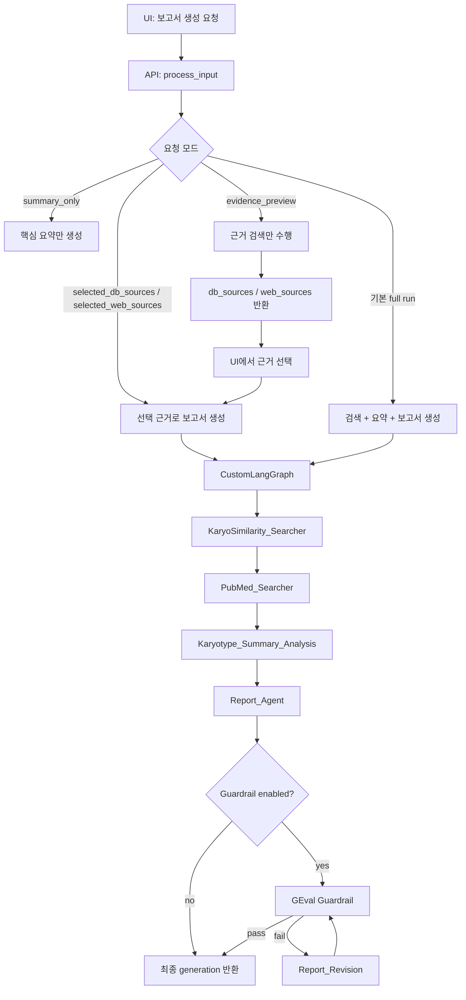

# LLM 보고서 생성 과정 전달 문서 - automation_smb 적용 가이드

> **상태: 운영 전환 단계까지 보류.** 현재 `dev_codex`는 합성 데이터 전용 일반 챗봇 기능 테스트에 집중한다.
> 이 문서의 의료데이터 정책, guardrail, provider 차단, redaction 제안은 현재 Playground 실행 경로에 적용하지 않는다.
> 기본 챗봇 테스트가 완료된 뒤 운영 보안 검토 자료로 다시 평가한다.

**작성 목적**: 현재 CytogeneticsProject의 LLM 보고서 생성 흐름을 `automation_smb` 프로젝트의 `/playground` tool 구조로 옮기기 위한 전달 문서입니다.
**전달 대상**: `C:\Users\AI_team\Desktop\project\automation_smb`, branch `dev_codex`
**권장 신규 위치**: `src/smb_finder/reports/`

---

## 1. 핵심 요약

현재 프로젝트의 LLM 보고서 생성은 다음 원칙으로 동작합니다.

1. **검색과 생성 분리**
   - 1차로 근거를 검색하고 `db_sources`, `web_sources` 형태로 반환합니다.
   - 사용자가 근거를 선택하면 2차로 선택된 근거만 LLM 보고서 생성에 사용합니다.

2. **템플릿 + LLM 혼합**
   - Jinja2 템플릿이 보고서 골격, 검사 정보, 기본 섹션을 만듭니다.
   - LLM은 최종 보고서 전체를 자유 생성하지 않고, 주로 `Interpretation` 본문을 근거 기반으로 개선합니다.

3. **동일 엔진 재사용**
   - 운영 API, LangGraph CLI/Studio, validation batch가 같은 `CustomLangGraph`를 호출합니다.
   - 프롬프트는 YAML로 분리되어 있어 문구 튜닝은 코드보다 YAML 변경을 우선합니다.

4. **선택 근거 경로가 automation_smb에 가장 적합**
   - `/playground`에서 tool allowlist를 이미 쓰고 있으므로, 보고서 tool도 `preview -> selected evidence -> generate` 계약으로 붙이는 것이 좋습니다.
   - SMB 파일 검색 결과나 내부 문서 스니펫은 외부 LLM에 직접 보내지 않고, local/on-prem provider에서만 사용하도록 기본 정책을 둡니다.

---

## 2. 현재 프로젝트의 구현 위치

| 역할 | 현재 파일 |
| --- | --- |
| LLM 서비스 초기화 / 실행 facade | `backend/api/services/llm_service.py` |
| API 진입점 | `backend/api/views.py` (`ApiHomeLlmServiceViewSet.process_input`) |
| LangGraph 보고서 워크플로우 | `backend/customLanggraph/tools/custom_langgraph.py` |
| LLM/도구 wiring | `backend/customLanggraph/tools/custom_chain.py` |
| 보고서 템플릿 렌더링 | `backend/api/services/report_service.py` |
| Jinja2 보고서 템플릿 | `backend/templates/report_templates/*.md.j2` |
| 프롬프트 YAML 로더 | `backend/customLanggraph/services/llm_prompt_loader.py` |
| 통합 프롬프트 YAML | `backend/customLanggraph/resources/cytogenetics_llm_prompts.yaml` |
| Interpretation 프롬프트 조립 | `backend/customLanggraph/tools/report_agent_llm_prompts.py` |
| 핵형 요약 프롬프트 조립 | `backend/customLanggraph/tools/karyotype_summary_prompts.py` |
| 가드레일 평가/재작성 | `backend/customLanggraph/services/guardrail_service.py` |
| 결과/근거 저장 | `backend/postgreSQL/services/test_result_service.py` |
| 검증 배치 | `backend/validation/run_validation_pipeline.py` |

---

## 3. 전체 흐름



automation_smb에서는 `KaryoSimilarity_Searcher`, `PubMed_Searcher`를 그대로 옮기기보다 아래처럼 치환하는 것이 맞습니다.

| CytogeneticsProject | automation_smb 권장 치환 |
| --- | --- |
| 내부 DB 유사 핵형 검색 | SMB 폴더/파일 검색 결과, 사내 지식 문서 검색 결과 |
| PubMed/Atlas 검색 | 검사별 내부 reference 문서, SOP, 보고서 예시, 필요 시 내부 DB |
| `Karyotype_Summary_Analysis` | 검사 결과/입력값 factual summary |
| `Report_Agent` | 세포유전/NGS 보고서 초안 생성 또는 Interpretation 작성 |
| `Guardrail` | 환자정보 외부 전송 금지, 근거 없는 주장 금지, 검사 도메인 품질 체크 |

---

## 4. API 계약에서 가져갈 것

현재 API는 하나의 endpoint에서 모드를 나눕니다.

`POST /api/home-llm-service/process_input/`

### 4.1 근거 검색만

```json
{
  "input": "46,XX,t(9;22)(q34;q11.2)[20]",
  "search_condition": {
    "search_type": "bone_marrow",
    "test_code": "72000",
    "test_sub_code": ""
  },
  "evidence_preview": true
}
```

응답 핵심:

```json
{
  "success": true,
  "evidence_preview": true,
  "generation": "",
  "test_result_id": "optional-draft-id",
  "db_sources": [],
  "web_sources": []
}
```

automation_smb 권장:

- `cytogenetics_report.preview` 또는 `ngs_report.preview` tool은 LLM 호출 없이 내부 SMB/index 검색 결과만 반환합니다.
- SMB credential, 내부 IP, 환자/검사 원문 전체를 trace나 외부 provider로 보내지 않습니다.
- 결과 row는 `source_id`, `title`, `path_label`, `snippet`, `score`, `selected` 정도만 UI에 넘깁니다.

### 4.2 선택 근거로 보고서 생성

```json
{
  "input": "46,XX,t(9;22)(q34;q11.2)[20]",
  "search_condition": {
    "search_type": "bone_marrow",
    "test_code": "72000",
    "test_sub_code": ""
  },
  "selected_db_sources": [
    {
      "source_id": "DB1",
      "title": "내부 유사 사례",
      "snippet": "..."
    }
  ],
  "selected_web_sources": [
    {
      "source_id": "WEB1",
      "title": "reference",
      "snippet": "..."
    }
  ],
  "guardrail_enabled": false
}
```

현재 구현에서는 `run_cytogenetics_with_selected_evidence()`가 선택 근거를 `forced_db_sources`, `forced_web_sources`로 state에 넣고 `skip_search_phase=True`로 그래프를 실행합니다. 이 패턴이 `/playground` selected tool 모델과 잘 맞습니다.

automation_smb 권장:

```python
ReportRequest(
    report_type="cytogenetics" | "ngs",
    user_input=str,
    selected_sources=list[EvidenceSource],
    settings=ReportSettings,
    provider="local" | "openai",
)
```

그리고 handler 내부에서 다음을 강제합니다.

- selected source가 없으면 보고서를 생성하지 않거나 "근거 없음" 안내만 반환합니다.
- 기본 provider는 local/on-prem입니다.
- OpenAI provider는 사용자가 Settings에 API key를 직접 저장/입력한 경우에만 활성화합니다.
- 실제 환자/검사 데이터는 OpenAI/LangSmith Cloud로 보내지 않습니다.

---

## 5. 현재 LangGraph 노드별 의미

### 5.1 `KaryoSimilarity_Searcher`

현재 역할:

- 입력 핵형과 검사 조건을 바탕으로 내부 DB/pgvector 유사 핵형을 검색합니다.
- 검색 실패 여부와 관계없이 다음 PubMed 단계로 진행합니다.

automation_smb 치환:

- SMB content index 또는 파일 본문 검색 결과를 EvidenceSource 배열로 변환합니다.
- read-only 기본을 지키고, tool에서는 파일 수정/삭제를 하지 않습니다.

### 5.2 `PubMed_Searcher`

현재 역할:

- PubMed/Atlas 근거를 수집합니다.
- 최종 보고서에서 citation 가능한 `web_sources`로 정리합니다.

automation_smb 치환:

- 외부 PubMed보다 사내 문서, SOP, 기존 보고서 양식, 검사별 rule 문서를 우선합니다.
- 외부 검색이 필요한 경우에도 환자/검사 원문 없이 질환/검사 일반 키워드만 사용하도록 분리합니다.

### 5.3 `Karyotype_Summary_Analysis`

현재 역할:

- 입력 ISCN 자체에서 관찰 사실만 요약합니다.
- 질병명, 예후, 치료, citation을 넣지 않도록 별도 프롬프트로 제한합니다.

automation_smb 치환:

- `factual_summary` 단계로 일반화합니다.
- 예: "검체/검사명/주요 variant/coverage/QC status/양성 여부"를 근거 없이 확대 해석하지 않고 정리합니다.
- 첫 수직 슬라이스는 `/playground`의 `cytogenetics_karyotype_summary` tool로 구현합니다.
- 이 단계는 선택한 LLM provider/model이 입력 ISCN의 관찰 사실을 요약하며, 내부 규칙 parser나 문장 조립기를 사용하지 않습니다. prompt는 질병명·진단·예후·치료·citation을 생성하지 않도록 제한합니다.
- 실제 검사 결과인 원본 ISCN이 외부 provider에 전달되지 않도록, OpenAI 선택 시 LLM 호출 전에 tool 사용을 차단합니다.

### 5.4 `Report_Agent`

현재 역할:

1. `ReportService.generate_report()`로 Jinja2 템플릿 초안을 렌더링합니다.
2. `materialize_report_enhancement_llm_prompt()`로 Interpretation 전용 프롬프트를 만듭니다.
3. 선택/검색 근거를 LLM 입력에 넣습니다.
4. LLM 출력은 `sanitize_llm_report_output()` 이후 템플릿 결과와 병합합니다.
5. 최종 Markdown을 `generation`으로 반환합니다.

automation_smb 치환:

- `cytogenetics_report`와 `ngs_report` 모두 "템플릿 초안 -> LLM 본문 작성 -> sanitize -> render result" 단계를 공유합니다.
- 도메인별 차이는 template, schema, prompt pack, validation rule만 분리합니다.

### 5.5 `Guardrail` / `Report_Revision`

현재 역할:

- GEval 형식으로 최종 보고서를 0-10점 평가합니다.
- 실패하면 최대 횟수 안에서 재작성 후 다시 평가합니다.
- 평가 이력은 UI에서 볼 수 있게 `report_snapshots`로 반환합니다.

automation_smb 권장:

- 기본은 off 또는 local evaluator만 사용합니다.
- 외부 tracing이 켜져 있어도 환자/검사 데이터는 LangSmith Cloud로 보내지 않습니다.
- guardrail 항목은 최소한 다음을 포함합니다.
  - 선택 근거 밖의 주장 금지
  - 환자 식별정보 노출 금지
  - 검사 결과와 모순되는 결론 금지
  - "확진/치료 지시"처럼 권한을 넘는 문구 제한

---

## 6. 권장 패키지 구조

`automation_smb`에 아래 구조를 추가하는 것을 권장합니다.

```text
src/smb_finder/reports/
  __init__.py
  models.py
  registry.py
  service.py
  providers.py
  evidence.py
  guardrails.py
  templates/
    cytogenetics_report.md.j2
    ngs_report.md.j2
  prompts/
    cytogenetics_report.yaml
    ngs_report.yaml
  handlers/
    __init__.py
    cytogenetics_report.py
    ngs_report.py
```

역할:

| 파일 | 역할 |
| --- | --- |
| `models.py` | `ReportRequest`, `ReportResult`, `EvidenceSource`, `ReportSettings` 같은 공통 계약 |
| `registry.py` | `/playground` tool registry에 노출할 tool metadata |
| `service.py` | 공통 보고서 생성 orchestration |
| `providers.py` | local/on-prem/OpenAI provider 선택 및 정책 enforcement |
| `evidence.py` | SMB 검색 결과를 보고서 근거 스키마로 변환 |
| `guardrails.py` | PII/근거성/품질 검사 |
| `handlers/*` | 도메인별 preview/generate handler |
| `templates/*` | Jinja2 보고서 골격 |
| `prompts/*` | LLM system/user prompt pack |

---

## 7. 공통 모델 초안

```python
from dataclasses import dataclass, field
from typing import Any, Literal


ReportKind = Literal["cytogenetics", "ngs"]
ProviderKind = Literal["local", "openai"]


@dataclass
class EvidenceSource:
    source_id: str
    title: str
    snippet: str
    source_type: Literal["smb_file", "content_index", "manual", "internal_db"]
    path_label: str | None = None
    score: float | None = None
    metadata: dict[str, Any] = field(default_factory=dict)


@dataclass
class ReportSettings:
    provider: ProviderKind = "local"
    model: str | None = None
    guardrail_enabled: bool = False
    debug_trace_enabled: bool = False


@dataclass
class ReportRequest:
    report_type: ReportKind
    user_input: str
    selected_sources: list[EvidenceSource]
    settings: ReportSettings = field(default_factory=ReportSettings)
    structured_input: dict[str, Any] = field(default_factory=dict)


@dataclass
class ReportResult:
    success: bool
    report_markdown: str
    sources_used: list[EvidenceSource]
    warnings: list[str] = field(default_factory=list)
    debug: dict[str, Any] = field(default_factory=dict)
```

---

## 8. Tool registry 계약 예시

현재 Playground tool:

- `find_folder`
- `search_content`
- `refresh_content`

추가 권장 tool:

```python
{
    "name": "cytogenetics_report",
    "description": "선택된 SMB 검색 근거를 기반으로 세포유전 보고서 초안을 생성합니다.",
    "input_schema": {
        "type": "object",
        "properties": {
            "user_input": {"type": "string"},
            "selected_source_ids": {
                "type": "array",
                "items": {"type": "string"}
            },
            "structured_input": {"type": "object"},
            "guardrail_enabled": {"type": "boolean"}
        },
        "required": ["user_input", "selected_source_ids"]
    }
}
```

```python
{
    "name": "ngs_report",
    "description": "선택된 SMB 검색 근거와 NGS 결과 구조화 입력을 기반으로 NGS 보고서 초안을 생성합니다.",
    "input_schema": {
        "type": "object",
        "properties": {
            "user_input": {"type": "string"},
            "selected_source_ids": {
                "type": "array",
                "items": {"type": "string"}
            },
            "structured_input": {
                "type": "object",
                "properties": {
                    "gene": {"type": "string"},
                    "variant": {"type": "string"},
                    "transcript": {"type": "string"},
                    "classification": {"type": "string"}
                }
            },
            "guardrail_enabled": {"type": "boolean"}
        },
        "required": ["user_input", "selected_source_ids"]
    }
}
```

주의:

- tool input에는 SMB credential, 내부 IP, API key를 절대 포함하지 않습니다.
- `selected_source_ids`는 서버 측 세션/index에서 EvidenceSource를 재조회하는 키로만 씁니다.
- trace/raw debug 토글이 켜져도 secret과 환자/검사 원문은 redaction 후 표시합니다.

---

## 9. Provider 정책

현재 프로젝트는 OpenAI 기반 `ChatOpenAI`를 사용하지만, automation_smb의 기본 정책은 다릅니다.

automation_smb 보고서 tool에서는 아래 순서를 강제합니다.

1. `local/on-prem LLM`을 기본 provider로 사용합니다.
2. OpenAI는 사용자가 Settings에 API key를 넣고 provider를 명시 선택한 경우만 허용합니다.
3. OpenAI provider 선택 시에도 실제 환자/검사 데이터, SMB 파일 원문, 내부 경로, 내부 IP는 전송 금지입니다.
4. LangSmith Cloud tracing에는 실제 환자/검사 데이터와 SMB 본문을 보내지 않습니다.
5. token usage는 provider 응답 metadata만 저장하고 prompt 원문 저장은 기본 off로 둡니다.

권장 guard 함수:

```python
def enforce_provider_policy(request: ReportRequest, settings: AppSettings) -> None:
    if request.settings.provider == "openai":
        if not settings.user_openai_api_key:
            raise PermissionError("OpenAI provider requires a user-provided API key.")
        if contains_patient_or_internal_data(request):
            raise PermissionError("Patient/test/internal SMB data cannot be sent to OpenAI.")
```

---

## 10. 결과 표시 UI 요구사항

현재 Home/WorkList UI는 다음 상태를 다룹니다.

- 근거 검색 결과 표시
- 각 근거 선택/해제
- 선택 근거로 보고서 생성
- `generation` Markdown 표시
- `db_sources`, `web_sources` 또는 통합 evidence 목록 표시
- guardrail 점수/사유/재작성 이력 표시
- `test_result_id` 기반 세션 복원

automation_smb `/playground`에서는 최소 다음 표시가 필요합니다.

1. tool call summary
   - 어떤 tool이 호출됐는지
   - 입력 중 redacted summary
   - 선택된 source 수

2. report output
   - Markdown render
   - copy 가능
   - warning/guardrail 실패 사유 표시

3. sources used
   - title/snippet/path_label
   - selected 여부
   - 원문 열람은 권한 있는 내부 viewer 또는 SMB read-only 링크로만

4. debug panel
   - raw debug 토글 off 기본
   - 켜도 credential/API key/internal IP/환자정보 redaction
   - token usage와 provider latency는 별도 표시 가능

---

## 11. 개발 순서 제안

요청된 다음 목표에 맞춘 권장 순서입니다.

1. 현재 LangSmith/token usage 변경분 안정화 및 커밋
   - trace payload에 환자/검사 데이터가 들어가지 않는지 먼저 확인합니다.
   - token usage는 provider/model/call id/input token/output token 정도로 제한합니다.

2. 보고서 tool 공통 모델/계약 추가
   - `src/smb_finder/reports/models.py`
   - `ReportRequest`, `ReportResult`, `EvidenceSource`, provider policy

3. 세포유전 보고서 tool 1차 구현
   - `handlers/cytogenetics_report.py`
   - selected SMB/index 근거만 사용
   - local LLM 우선
   - Jinja2 템플릿 + LLM 본문 생성

4. NGS 보고서 tool 1차 구현
   - `handlers/ngs_report.py`
   - gene/variant/classification 같은 구조화 입력을 받되, 근거 없는 임상 확정 표현 제한

5. Playground UI 결과 표시 확장
   - selected sources
   - report markdown
   - guardrail/warnings
   - token usage
   - redacted raw debug

---

## 12. 검증 체크리스트

기능 체크:

- 근거 검색만 실행하면 LLM 호출이 발생하지 않는다.
- 선택된 근거가 없으면 보고서 생성을 막거나 안전 안내를 반환한다.
- 선택된 근거만 prompt에 들어간다.
- local provider만으로 end-to-end 생성된다.
- OpenAI provider는 Settings API key 없이는 호출되지 않는다.

보안 체크:

- SMB credential이 로그, trace, response, git diff에 없다.
- 내부 IP와 실제 SMB UNC path가 외부 provider prompt에 없다.
- 환자명, 접수번호, 검사 원문은 OpenAI/LangSmith Cloud로 가지 않는다.
- raw debug 토글 출력은 redaction 후 표시된다.
- SMB 접근은 read-only다.

품질 체크:

- 보고서가 template section을 유지한다.
- LLM이 선택 근거 밖 질환/치료/예후를 추가하지 않는다.
- NGS variant classification 문구가 입력 classification과 모순되지 않는다.
- 세포유전 ISCN/핵형 입력을 임의 수정하지 않는다.
- guardrail 실패 시 사용자가 이유를 볼 수 있다.

---

## 13. automation_smb에 넘길 핵심 설계 문장

`automation_smb`의 보고서 tool은 "챗봇이 임의로 전체 SMB를 읽고 보고서를 쓰는 기능"이 아니라, 사용자가 `/playground`에서 선택한 tool과 선택한 근거만으로 검사실 보고서 초안을 만드는 제한형 업무 보조 기능이어야 합니다.

따라서 구현의 중심 계약은 다음입니다.

```text
search_content/find_folder -> EvidenceSource 후보 표시
사용자 또는 agent loop가 allowlist tool에서 source 선택
cytogenetics_report/ngs_report -> selected sources만 입력으로 보고서 초안 생성
local/on-prem LLM 기본
OpenAI는 사용자 API key + 데이터 반출 정책 통과 시에만 허용
결과, 근거, token usage, redacted debug를 Playground에 표시
```

이 구조를 따르면 현재 프로젝트의 LLM 보고서 생성 경험을 유지하면서도, automation_smb의 보안 원칙과 자체 `/playground` UI 방향에 맞게 확장할 수 있습니다.
