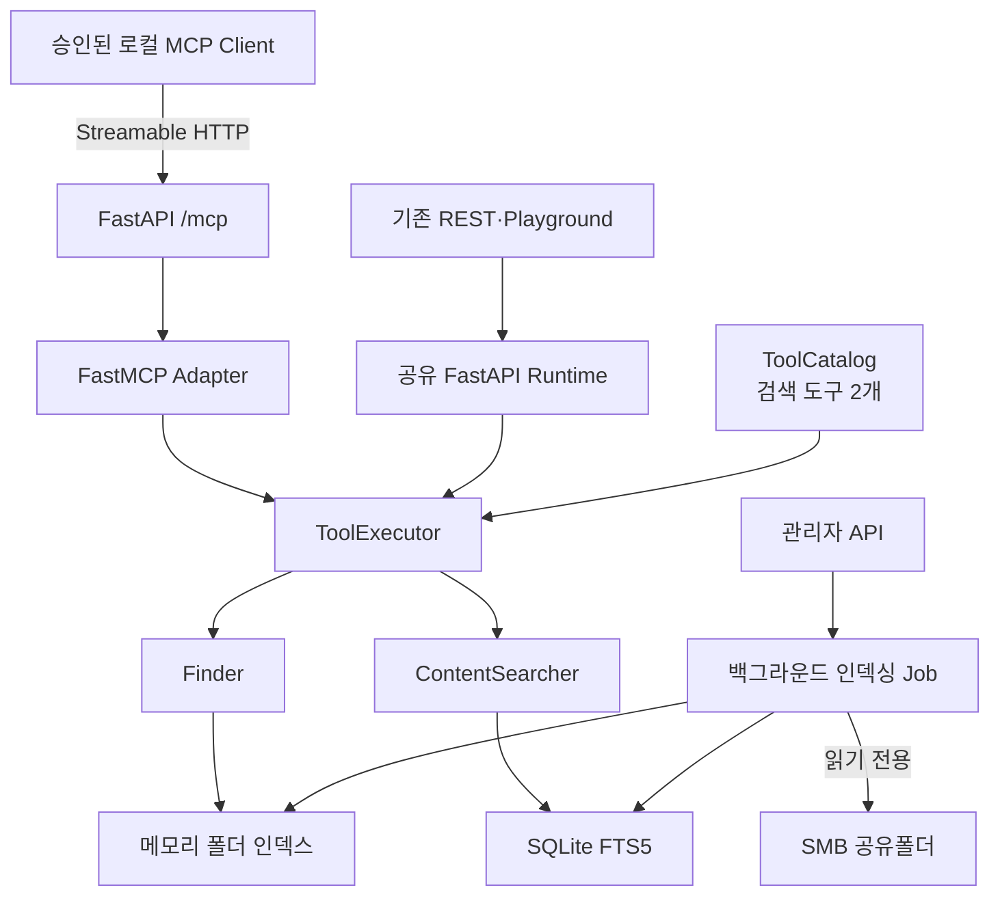

# automation-smb MCP 적용 구현 계획

> 상태: M0–M2 로컬 MVP 구현 완료 — 사내 다중 사용자 공개·OAuth/SSO·LangGraph 전환은 후속 단계다.
>
> 기준일: 2026-07-14
>
> 상위 설계: [TOOL_MCP_LANGCHAIN_ARCHITECTURE.md](TOOL_MCP_LANGCHAIN_ARCHITECTURE.md)

## 1. 구현 결정 요약

MCP MVP는 기존 FastAPI 프로세스에 `/mcp` Streamable HTTP 앱을 마운트한다. 별도 `stdio` 프로세스를 먼저
만들지 않는다. 현재 `Finder`, `ContentSearcher`, 메모리 인덱스, SQLite FTS5 연결이 FastAPI lifespan의
`_state`에서 관리되기 때문에 같은 프로세스를 사용해야 초기화 중복과 불필요한 HTTP 우회를 피할 수 있다.

MVP 공개 도구는 다음 두 개로 고정한다.

- `find_folder`
- `search_content`

다음 기능은 MVP MCP 범위에서 제외한다.

- `refresh_content`와 모든 관리자 API
- SMB 쓰기·이동·삭제
- `cytogenetics_report`, `ngs_report`
- `cytogenetics_karyotype_summary`
- MCP Resources, Prompts, Sampling
- LangGraph Agent의 즉시 교체
- 사내망 전체 공개와 사용자별 SSO

기존 REST와 Playground 계약은 그대로 유지한다. MCP는 feature flag로 독립 활성화하며 문제가 생기면 설정 하나로
비활성화할 수 있어야 한다.

## 2. 재검토에서 바뀐 내용

상위 설계 문서의 방향은 유지하되 실제 착수 순서를 다음처럼 수정한다.

| 항목 | 이전 초안 | 확정 계획 |
|---|---|---|
| 첫 전송 방식 | 로컬 `stdio` 우선 | 기존 FastAPI에 Streamable HTTP `/mcp` 마운트 |
| 공통 도구 전환 | 모든 도구를 한 번에 이관 가능 | 검색 두 개만 공통 계약으로 먼저 이관 |
| LangGraph | MCP와 함께 전환 가능 | MCP MVP 이후 별도 호환성 업그레이드로 분리 |
| 핵형요약 | 초기 공개 후보 | 로컬 LLM 정책 검증 후 마지막 단계 |
| 관리자 도구 | catalog 등록 후 숨김 가능 | MCP catalog 자체에 등록하지 않음 |
| timeout | 정의값 중심 | soft timeout과 동시 실행 제한을 실제 executor에서 집행 |

현재 `integrations/langgraph/smb_agent/tools.py`에는 `find_folder`, `search_content`, `refresh_content`의 LangChain
`@tool` HTTP 래퍼가 별도로 있다. 이 래퍼는 MCP MVP가 안정화될 때까지 rollback 경로로 남겨두고, 이후
`langchain-mcp-adapters`로 교체한다.

## 3. MVP 목표 구조



MCP 요청은 SMB를 실시간 순회하지 않는다. 인덱스가 준비되지 않았으면 제한된 실시간 fallback을 새로 만들지 않고
안전한 `runtime_not_ready` 오류를 즉시 반환한다.

## 4. 기술 기준

### 4.1 MCP SDK

- 공식 Python SDK `mcp>=1.28.1,<2`
- 2026-07-14 기준 v1.28.1이 최신 안정 버전
- v2 프리릴리스는 이번 구현에 사용하지 않음
- 실제 해석 버전은 `uv.lock`으로 고정
- 런타임에는 `mcp[cli]`를 넣지 않음
- MCP Inspector는 선택적 개발 도구로만 사용

### 4.2 전송과 ASGI 수명주기

FastMCP 설정은 다음을 기준으로 한다.

```python
FastMCP(
    "automation-smb-search",
    stateless_http=True,
    json_response=True,
    streamable_http_path="/mcp",
)
```

Starlette의 일반 sub-app mount가 `/mcp`를 `/mcp/`로 redirect하는 동작을 피하기 위해 exact ASGI route를
사용한다. FastMCP 내부 경로와 최종 endpoint를 모두 `/mcp`로 유지하며, 기존 REST route의 404/405 계약에는
영향을 주지 않는다. FastAPI lifespan에서 기존 검색 runtime과 `mcp.session_manager.run()`을 함께 시작하고
함께 종료한다.

SSE 전용 endpoint는 만들지 않는다. `stdio`는 데스크톱 MCP Host가 반드시 요구할 때 `/mcp`를 호출하는 로컬
브리지로 별도 검토한다.

### 4.3 설정

`.env.example`에는 값이 비어 있거나 안전한 기본값만 들어간다.

| 환경변수 | 기본값 | 의미 |
|---|---|---|
| `MCP_ENABLED` | `false` | `/mcp` 마운트 여부 |
| `MCP_ALLOW_REMOTE` | `false` | loopback 외 클라이언트 허용 여부 |
| `MCP_API_TOKEN` | 빈 값 | MCP 전용 bearer token; 활성화할 때 필수 |
| `MCP_ALLOWED_HOSTS` | `127.0.0.1,localhost,[::1]` | 허용할 Host 목록 |
| `MCP_ALLOWED_ORIGINS` | 빈 값 | 허용할 Origin 목록; wildcard 금지 |
| `MCP_MAX_BODY_BYTES` | `65536` | MCP 요청 본문 크기 상한 |

`ADMIN_API_TOKEN`은 MCP 인증에 재사용하지 않는다. `MCP_ALLOW_REMOTE=true`인데 `MCP_API_TOKEN`이 비어 있으면
안 되는 것뿐 아니라, `MCP_ENABLED=true`이면 remote 여부와 관계없이 `MCP_API_TOKEN`을 요구한다. 값이 비어 있으면
서버 시작을 실패시키거나 MCP를 비활성화해야 한다. 토큰은 constant-time으로 비교하며 요청·오류·trace·로그에
남기지 않는다. 기본 CORS는 비활성화하고 64KiB 초과 요청은 본문을 반사하지 않는 413 오류로 거부한다.

## 5. 공통 도구 계약

### 5.1 ToolSpec

프레임워크 중립적인 `ToolSpec`을 `@dataclass(frozen=True)`로 정의한다. Pydantic은 도구 입출력 계약에만 사용한다.

```python
@dataclass(frozen=True)
class ToolSpec:
    id: str
    display_name: str
    description: str
    permission: Literal["read", "admin"]
    input_model: type[BaseModel]
    output_model: type[BaseModel]
    timeout_ms: int
    enabled: bool
    expose_to_playground: bool
    expose_to_mcp: bool
    external_provider_allowed: bool
    run: ToolCallable
```

MVP에서는 검색 두 개만 공통 `ToolCatalog`로 옮긴다. 기존 보고서·관리자 도구는 현재 registry에 남기되,
`playground/tools.py`가 공통 검색 spec과 기존 spec을 합치는 호환 shim 역할을 한다.

### 5.2 입력 계약

| 도구 | 입력 | 제한 |
|---|---|---|
| `find_folder` | `query: str`, `limit: int | None` | 빈 문자열 거부, 상위 N건, 서버 기본 limit 우선 |
| `search_content` | `query: str`, `limit: int | None` | 빈 문자열 거부, 상위 N건, 서버 기본 limit 우선 |

검색어와 limit의 정확한 상한은 현재 REST의 정상 요청을 깨지 않는 값으로 정하고 characterization test로 고정한다.
MCP 입력에서는 host, share, 경로 override, provider, model, API key를 받지 않는다.

### 5.3 출력 계약

MCP 구조화 결과는 필요한 최소 필드만 반환한다.

| 도구 | 허용 필드 |
|---|---|
| `find_folder` | 결과 이름, 공유 루트 기준 상대경로, 점수, 깊이, 결과 수, `elapsed_ms`, `over_budget` |
| `search_content` | 결과 이름, 공유 루트 기준 상대경로, 확장자, 점수, 결과 수, `elapsed_ms`, `over_budget` |

다음은 MVP MCP 결과에서 제외한다.

- SMB host와 share 이름
- 자격증명과 내부 IP
- UNC·로컬 절대경로
- 원본 query 복제
- 문서 본문과 snippet
- 인덱스 DB의 실제 로컬 경로

MCP 도구에는 다음 annotation을 사용한다.

- `readOnlyHint=true`
- `destructiveHint=false`
- `idempotentHint=true`
- `openWorldHint=false`

## 6. ToolExecutor 책임 경계

`ToolExecutor`가 담당하는 것:

1. 도구 존재와 활성화 여부
2. 호출 surface별 allowlist
3. `permission`과 MCP 공개 여부
4. Pydantic 입력·출력 검증
5. 도구 timeout과 동시 실행 제한
6. 결과 건수 제한과 redaction
7. `elapsed_ms`, `over_budget`, 안전한 `error_code`
8. 민감 본문 없는 감사 이벤트

`ToolExecutor`가 담당하지 않는 것:

- Agent 최대 step
- Agent의 중복·재귀 tool call 차단
- LLM plan과 최종 답변 생성
- 대화 history 관리

이 항목들은 현재 `PlaygroundAgent` 또는 이후 LangGraph 오케스트레이션이 담당한다. 정책 경계를 분리해 단순 MCP
호출에 Agent 상태가 섞이지 않게 한다.

현재 도구 함수는 동기식이므로 timeout이 발생해도 실행 중인 worker thread를 안전하게 강제 종료할 수 없다.
읽기 전용·멱등 도구에 한해 soft timeout을 사용하고, 취소된 호출의 thread를 버릴 수 있게 하며, semaphore로 동시
실행 수를 제한한다. 이 제한은 인덱스 검색이 장시간 점유될 때 thread가 누적되는 것을 막기 위한 필수 조건이다.

## 7. 보안 경계

### 7.1 로컬 MVP

- `MCP_ENABLED=false`가 기본값
- 활성화 후에도 loopback 요청만 허용
- 활성화하려면 별도 `MCP_API_TOKEN`이 반드시 필요
- Host를 `127.0.0.1`, `localhost`, `[::1]`로 제한
- 요청의 `Origin`이 존재하면 명시적 allowlist로 검증
- CORS `*` 사용 금지
- 요청 본문을 64KiB로 제한
- 실제 SMB와 환자 데이터 대신 합성·비식별 fixture로 검증

### 7.2 remote 전환 조건

다음 조건이 모두 갖춰지기 전에는 `MCP_ALLOW_REMOTE=true`를 사용하지 않는다.

- 별도 `MCP_API_TOKEN` 또는 사용자별 OAuth/SSO
- 사내망 방화벽·reverse proxy 접근제어
- Origin·Host 검증
- TLS 종단 위치 확정
- 사용자별 도구 allowlist
- 감사 로그 보존·접근 정책
- 승인된 MCP Host 목록

MCP 서버는 연결한 Host가 도구 결과를 외부 모델이나 자체 trace에 전달하는 것을 기술적으로 완전히 통제할 수 없다.
따라서 운영 연결 대상은 로컬·온프레미스 Host로 한정하고 외부 provider를 쓰는 클라이언트에는 연결하지 않는다.

### 7.3 감사 로그

기록 가능한 필드:

- correlation ID
- client 구분값 또는 비식별 hash
- tool ID
- 허용·차단·성공·실패 판정
- `elapsed_ms`, `over_budget`, result count
- 안전한 `error_code`

기록 금지 필드:

- query와 tool arguments 원문
- 결과 이름·경로·본문
- 자격증명·token·내부 주소
- 원본 ISCN

## 8. 단계별 작업 계획

### M0 — 회귀 기준 고정

목표: 구조 변경 전에 현재 동작을 테스트로 고정한다.

- 현재 Playground 도구 목록과 권한 metadata 확인
- `/find`, `/search-content` 결과 정렬·건수·오류 확인
- 관리자 도구 자동 실행 차단 확인
- 외부 provider 차단과 redaction 확인
- REST operation ID 유지 확인
- 테스트는 fake runtime과 임시 SQLite를 사용하고 실제 SMB·외부 LLM을 호출하지 않음

완료 gate:

- 관련 기존 테스트 통과
- 추가 characterization test 통과
- 작업 전후 REST 응답 계약 diff 없음

### M1 — 공통 검색 ToolCatalog와 ToolExecutor

목표: 검색 두 개만 공통 계약과 executor를 사용한다.

신규 파일 후보:

```text
src/smb_finder/tooling/__init__.py
src/smb_finder/tooling/contracts.py
src/smb_finder/tooling/catalog.py
src/smb_finder/tooling/executor.py
tests/test_tooling.py
```

수정 파일 후보:

```text
src/smb_finder/playground/tools.py
src/smb_finder/playground/agent.py
tests/test_playground.py
```

완료 gate:

- 기존 `build_tool_registry()` import와 반환 계약 유지
- 검색 결과·오류·지연 필드 parity 통과
- 관리자·보고서 tool 동작 변화 없음
- executor가 MCP surface에서 admin tool을 실행하지 못함

### M2 — FastAPI `/mcp` MVP

목표: 기존 runtime을 공유하는 읽기 전용 MCP endpoint를 제공한다.

신규 파일 후보:

```text
src/smb_finder/mcp_server.py
src/smb_finder/tooling/adapters/__init__.py
src/smb_finder/tooling/adapters/mcp.py
tests/test_mcp_server.py
```

수정 파일 후보:

```text
src/smb_finder/api.py
src/smb_finder/config.py
.env.example
pyproject.toml
uv.lock
README.md
docs/TOOL_MCP_LANGCHAIN_ARCHITECTURE.md
```

완료 gate:

- `MCP_ENABLED=false`이면 `/mcp`가 404
- 활성화하면 `tools/list`가 정확히 검색 도구 두 개만 반환
- `tools/call`이 기존 Finder·ContentSearcher를 한 번만 실행
- MCP와 REST 결과의 건수·정렬 parity 통과
- runtime 미준비, 빈 query, timeout이 안전한 MCP 오류로 반환
- 관리자·보고서·핵형요약 도구가 목록에 없음
- 결과와 로그에 금지 필드가 없음

### M3 — LangGraph MCP client 이관

목표: LangGraph의 수동 HTTP `@tool` 래퍼를 MCP client로 단계적으로 교체한다.

`langchain-mcp-adapters==0.3.0`은 `langchain-core>=1,<2`를 요구한다. 현재 integration은
`langchain-core>=0.3` 전제이므로 M2와 같은 변경에 섞지 않는다.

작업:

- `SMB_AGENT_TOOL_TRANSPORT=rest|mcp` 설정 추가
- 초기 기본값 `rest`
- MCP client에 `/mcp`와 인증 header 연결
- `find_folder`, `search_content` parity·Agent 회귀 테스트
- 검증 후 기본값을 `mcp`로 전환
- `refresh_content`는 MCP Agent 도구에서 제거하고 관리자 API로만 유지
- 충분한 안정화 후 수동 REST wrapper 삭제

rollback:

- `SMB_AGENT_TOOL_TRANSPORT=rest`로 즉시 복귀

### M4 — 보고서 도구 확장

M2와 M3가 안정화된 뒤 아래 순서로 추가한다.

1. `cytogenetics_report`
2. `ngs_report`

조건:

- 후보 문서·체크리스트만 반환
- 실제 검사값·판정 자동 생성 금지
- snippet 제외
- 기존 보고서 Pydantic 모델을 출력 schema로 재사용
- read-only annotation과 기존 시간 예산 유지

### M5 — 핵형요약 보안 검토와 확장

별도 승인 조건:

- MCP 입력은 `iscn`만 허용
- provider, model, URL, API key 입력 금지
- 서버 설정의 로컬 LLM만 사용
- 외부 provider 경로 비활성
- 원본 ISCN을 로그·오류·감사 이벤트에 남기지 않음
- 진단·예후·치료 판단을 생성하지 않음
- LLM timeout과 도구 timeout 일치

## 9. 테스트 계획

### 9.1 필수 자동 테스트

| 범주 | 확인 내용 |
|---|---|
| catalog | 검색 도구 두 개의 schema·permission·exposure flag |
| executor | 입력 오류, disabled, admin 차단, timeout, 안전한 오류 |
| MCP 목록 | 정확히 `find_folder`, `search_content` |
| MCP 호출 | 구조화 출력 schema, 결과 parity, 한 번만 실행 |
| 보안 | token·remote·Host·Origin·요청 크기 차단, 금지 필드·로그 누출 없음 |
| lifecycle | FastAPI와 MCP session manager 시작·종료 |
| 회귀 | REST operation ID, Playground 도구·Agent·trace |
| 실패 | runtime 미준비, 비어 있는 인덱스, SQLite 오류 |

테스트는 fake Finder, fake ContentSearcher, 임시 SQLite fixture를 사용한다. 실제 SMB 세션과 외부 LLM은 사용하지 않는다.

### 9.2 지연 검증

- 인메모리 폴더 검색 50ms 미만 목표 유지
- 검색 요청 p50 300ms 미만, p95 1초 미만 유지
- 로컬 MCP adapter 오버헤드 p95 50ms 이하를 잠정 목표로 측정
- CI의 불안정한 단일 시간 assertion 대신 반복 local smoke 결과를 기록
- 예산 초과 시 `over_budget`와 안전한 부분 결과 또는 오류를 즉시 반환

### 9.3 실행 명령

구현 후 기본 검증 명령은 다음으로 고정한다.

```powershell
uv sync --python 3.11 --native-tls --extra dev
uv run --no-sync ruff check .
uv run --no-sync pytest -m "not integration"
uv run --no-sync pytest tests/test_tooling.py tests/test_mcp_server.py tests/test_playground.py tests/test_api_contracts.py
```

MCP Inspector는 선택 검증이다. 사내 SSL 프록시에서 `npx`가 실패하면 필수 검증으로 취급하지 않고 Python SDK
client 테스트를 기준으로 삼는다.

### 9.4 M0–M2 로컬 검증 결과 (2026-07-14)

- `uv run --no-sync ruff check .`: 통과
- `uv run --no-sync pytest -m "not integration"`: 115개 통과
- fake runtime 기반 `FastMCP.call_tool` 100회: p50 0.208ms, p95 0.278ms, max 0.505ms
- `MCP_ENABLED=false` 기본 상태의 `POST /mcp`: 404 확인
- 실제 SMB 세션, 환자/검사 파일, 로컬·외부 LLM은 검증에 사용하지 않음

## 10. 로컬 실행과 smoke 시나리오

구현 후 `.env`에서 다음처럼 로컬 전용으로 활성화한다.

```dotenv
MCP_ENABLED=true
MCP_ALLOW_REMOTE=false
MCP_API_TOKEN=<로컬에서 생성한 임의의 긴 값>
MCP_ALLOWED_HOSTS=127.0.0.1,localhost,[::1]
MCP_ALLOWED_ORIGINS=
MCP_MAX_BODY_BYTES=65536
```

실행:

```powershell
uv run --no-sync uvicorn smb_finder.api:app --host 127.0.0.1 --port 8010
```

예상 endpoint:

```text
FastAPI: http://127.0.0.1:8010
MCP:     http://127.0.0.1:8010/mcp
```

안전한 smoke 순서:

1. 합성·비식별 인덱스 fixture 사용
2. MCP initialize
3. `tools/list`가 검색 도구 두 개만 반환하는지 확인
4. `find_folder` 합성 키워드 호출
5. `search_content` 합성 키워드 호출
6. 빈 query·잘못된 limit·runtime 미준비 오류 확인
7. token 누락·오류, remote 주소, 잘못된 Host·Origin, 64KiB 초과 요청 차단 확인
8. 로그에 query·경로·token이 없는지 확인

## 11. 롤백 계획

- `MCP_ENABLED=false`로 endpoint 즉시 비활성화
- 기존 `/find`, `/search-content`, `/api/playground/*` 계속 유지
- 기존 `playground.tools` import 경로를 호환 shim으로 유지
- LangGraph는 `rest|mcp` 전환 설정으로 독립 rollback
- MCP parity와 지연·보안 검증 전에는 REST wrapper를 삭제하지 않음
- DB schema, 폴더 인덱스 JSON, SQLite FTS5 형식은 MVP에서 변경하지 않음

따라서 M0~M2의 rollback은 설정과 코드 배포 rollback만 필요하며 데이터 migration rollback은 필요하지 않다.

## 12. 역할별 개발 전달사항

### Backend

- M0~M2만 우선 구현
- 기존 Finder·ContentSearcher 알고리즘 수정 금지
- FastAPI `_state`와 MCP session manager 공유를 첫 integration test로 확인
- 관리자 도구를 임시로라도 MCP에 등록하지 않음
- 검색 timeout과 동시 실행 제한을 명시적으로 구현
- 기존 사용자 변경을 되돌리거나 덮어쓰지 않음

### Frontend

- MVP 변경 없음
- Playground 도구 목록·trace UI의 기존 동작만 회귀 확인
- MCP 연결상태 UI는 별도 요청 전까지 만들지 않음

### Shared·통합

- Pydantic 계약을 REST·Playground·MCP에서 재사용
- LangGraph 의존성 업그레이드는 M3으로 분리
- M2 완료 보고에 MCP endpoint, 도구 목록, 보안·지연 측정값 포함

## 13. 사용자 결정이 필요한 시점

M0~M2 로컬 MVP는 아래 보수적 기본값으로 추가 결정 없이 진행할 수 있다.

- MCP 기본 비활성
- loopback 전용
- 활성화 시 전용 bearer token 필수
- 검색 도구 두 개
- snippet과 관리자 도구 비공개
- 외부 LLM 미사용

사내 여러 사용자가 `/mcp`를 공유해야 하는 시점에는 다음을 사용자가 결정해야 한다.

- 단일 서비스 token 또는 사용자별 OAuth/SSO
- 허용할 MCP Host와 네트워크 대역
- 상대경로를 모델에게 보여줄 수 있는 업무 범위
- 감사 로그 보존 기간과 접근 권한

## 14. 공식 근거

- [MCP Python SDK v1.x](https://github.com/modelcontextprotocol/python-sdk/tree/v1.x)
- [MCP Python SDK v1.28.1](https://github.com/modelcontextprotocol/python-sdk/releases/tag/v1.28.1)
- [MCP Streamable HTTP 전송 명세](https://modelcontextprotocol.io/specification/2025-06-18/basic/transports)
- [MCP Tools 명세](https://modelcontextprotocol.io/specification/2025-06-18/server/tools)
- [LangChain MCP 연동](https://docs.langchain.com/oss/python/langchain/mcp)
- [langchain-mcp-adapters 0.3.0](https://pypi.org/project/langchain-mcp-adapters/0.3.0/)
