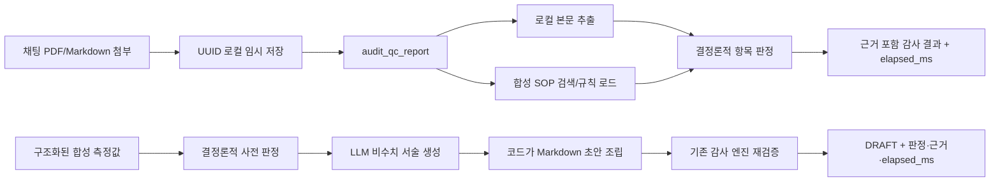

# QC Report 감사·LLM 초안 생성 우선 구현 계획

## 결정

현재 최우선 기능은 두 수직 슬라이스다. 첫째는 채팅에서 PDF/Markdown QC Report 한 건을 받아 로컬 SOP 근거와
대조하는 감사 경로이고, 둘째는 구조화된 합성 측정값을 결정론적으로 판정한 뒤 LLM 서술을 더해 검토용 Markdown
초안을 만드는 경로다. 기존 SMB 검색과 MCP M0–M2는 유지하며, 업무 tool은 Python 코드와 Pydantic 계약을 먼저
구현한 뒤 공통 catalog와 공개 surface를 별도로 결정한다.

검토한 `llm-wiki`와 `llm-wiki-qc-audit`의 유용한 구조는 문서 정규화, 근거 검색, 규칙 기반 판정, 결과 조립을
분리하는 방식이다. LLM은 수치·판정·근거를 결정하지 않고 비수치 서술만 생성하며, 코드는 초안을 조립한 뒤 기존
감사 엔진으로 다시 검증한다. 현재 저장소에는 실제 SOP나 의료 문서를 복사하지 않고 같은 역할 경계만 적용한다.

## 현재 입출력 계약

입력:

- 확장자: `.pdf`, `.md`, `.markdown`
- 한 요청당 파일 한 건, 기본 최대 10MiB
- PDF는 `pypdf`가 텍스트를 읽을 수 있는 텍스트형 문서
- 채팅 메시지는 비어 있어도 UI가 `첨부한 QC 보고서를 감사해줘`로 보완

출력:

- 문서 전체 판정: `PASS`, `WARNING`, `FAIL`, `UNVERIFIABLE`
- 항목별 SOP rule ID, 관찰값, 판정 이유, 기준, 근거 ID
- 추출·SOP 조회·판정·전체 소요 시간
- 합성 SOP 기반 기능 테스트라는 고지

LLM 초안 입력:

- `temperature_c`, `recovery_rate_pct`, `self_check_status` 세 합성 측정값
- 선택적인 `operator_notes`
- 선택한 local/OpenAI provider와 model

LLM 초안 출력:

- `DRAFT - HUMAN REVIEW REQUIRED`가 표시된 Markdown
- 코드가 고정한 관찰값 표·판정·criterion·evidence
- LLM이 생성한 숫자 없는 요약·해석·후속 검토 제안
- 결정론적 사전 판정과 생성 후 재감사 결과
- LLM·재검증·전체 소요 시간과 provider/model

`UNVERIFIABLE`은 필수 항목이 없거나 본문/값을 해석하지 못한 경우다. 실패와 확인 불가를 섞지 않아 사람이 후속
확인할 대상을 구분한다.

## 현재 구조

지원 tool:

| Tool | 역할 | 기본 사용 |
|---|---|---|
| `draft_qc_report` | 합성 측정값 판정 → LLM 서술 → Markdown 조립 → 재감사 | 일반 LLM agent 경로 |
| `audit_qc_report` | 추출·SOP 대조·판정을 조합하는 high-level tool | 첨부 채팅 fast path |
| `extract_uploaded_document` | PDF/Markdown 본문과 제한된 미리보기 반환 | 추출 진단·본문 확인 |
| `search_sop_knowledge` | 코드·제목·별칭으로 로컬 SOP 기준 검색 | 기준 질의·감사 근거 보조 |

감사는 tool 세 개를 agent가 순차 호출하지 않는다. high-level tool 내부에서 조합해 현재 요청당 최대 tool 호출 수 2를
넘지 않고 결정 LLM도 생략한다. 초안 생성은 agent가 입력 필드를 구성한 뒤 `draft_qc_report`를 한 번 호출하고, tool
안에서 LLM 한 번과 결정론적 재감사를 실행한다. tool 결과가 최종 답변이므로 추가 합성 LLM은 호출하지 않는다.

## 합성 기준 데이터

`backend/src/smb_finder/qc_audit/synthetic_sop_rules.json`은 기능 테스트 전용 세 항목을 제공한다.

- `SYN-QC-TEMP`: Aurora chamber temperature, 18.0–24.0 °C
- `SYN-QC-YIELD`: Nova recovery rate, 80.0–120.0 %
- `SYN-QC-STATUS`: Orion self-check, PASS/OK/정상

이 이름과 수치는 실제 장비·검사·SOP를 나타내지 않는다. 검토한 외부 저장소의 실제 데이터는 가져오지 않았다.

## 단계별 우선순위

### P0 — 로컬 합성 수직 슬라이스

- [x] 채팅 파일 첨부 UI와 로컬 저장 API
- [x] Markdown과 텍스트형 PDF 추출
- [x] 합성 SOP 검색 tool
- [x] 항목 누락, 범위 초과, 경계값, 정상값 판정
- [x] LLM 없는 감사 fast path와 지연 trace
- [x] Markdown/API 단위 테스트와 실제 합성 PDF smoke test

### P1 — LLM 기반 QC 보고서 초안

- [x] 세 합성 측정값과 선택적 메모의 Pydantic 입력 계약
- [x] LLM 호출 전 결정론적 SOP 판정
- [x] 숫자를 만들지 않는 LLM 요약·해석·후속 검토 JSON 계약
- [x] 코드가 관찰값·판정·criterion·evidence를 고정한 Markdown 조립
- [x] 기존 감사 엔진 재검증과 입력/초안 불일치 차단
- [x] `DRAFT`·사람 검토 필요·합성 SOP 고지와 단계별 지연 반환
- [x] PASS/WARNING/FAIL, 누락 입력, 잘못된 LLM 응답, agent 최종 응답 테스트

현재 P1은 Markdown 문자열만 반환하며 파일 저장·다운로드·최종 승인 상태 전이는 아직 제공하지 않는다.

### P2 — 실제 SOP compiler 연결 전 계약 고정

- [ ] SOP 문서 버전, 섹션/페이지, 발효일, 승인 상태 metadata 정의
- [ ] `llm-wiki` 계열 compiler 출력 중 가져올 JSON 계약과 라이선스/데이터 경계 확인
- [ ] 표/문단에서 관찰값을 추출하는 parser fixture 확대
- [ ] 감사 결과 JSON schema와 사람 검토/승인 상태 정의
- [ ] QC 초안의 `DRAFT → REVIEWED → APPROVED/REJECTED` 상태와 수정 이력 정의
- [ ] 승인된 보고서 템플릿, 필수 섹션, 서명·검토자 metadata 정의
- [ ] 실제 SOP 대신 구조만 닮은 합성 golden dataset으로 precision/recall 평가

### P3 — 문서 처리와 결과물 확장

- [ ] 이미지형 PDF 비율을 측정한 뒤 온프레미스 OCR 채택 여부 결정
- [ ] 페이지·표·섹션 위치 보존과 감사 근거 하이라이트
- [ ] 복수 파일/버전 비교, 암호화 PDF와 손상 문서 오류 계약
- [ ] 감사 결과와 승인된 QC 초안의 Markdown/PDF 내보내기 및 재현 가능한 run ID

### P4 — 운영 전환

- [ ] 실제 SOP·QC Report 사용 승인과 접근 권한 모델
- [ ] 보존 기간, 삭제 job, 감사 로그, 사용자별 추적성
- [ ] 운영 부하 p50/p95, cold/warm 지연, 대용량 문서 예산 검증
- [ ] 승인된 온프레미스 모델/OCR만 사용하는 외부 전송 차단 구조

### 후순위 — 공통 tool·자동화 확장

- QC tool의 공통 catalog 이관과 Playground 회귀 계약
- MCP 공개 범위, 인증, 사용자별 권한의 별도 승인
- 알림·승인·티켓 발행 등 후속 자동화

## 다음 결정에 필요한 정보

P0에는 추가 정보가 필요하지 않다. P1 착수 전에는 다음 세 가지를 확인해야 한다.

1. 실제 SOP 원본 형식과 compiler가 반환해야 할 최소 metadata
2. 실제 QC Report의 대표 레이아웃과 스캔 PDF 비율
3. FAIL/UNVERIFIABLE 결과와 LLM 초안을 누가 검토·승인하고 어디에 보존할지
4. 최종 QC 보고서의 승인 템플릿과 수정·서명·버전 관리 방식

이 정보가 확정되기 전에는 실제 의료 문서나 SOP를 저장소 fixture로 넣지 않는다.
