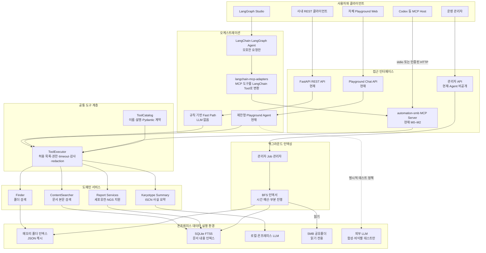
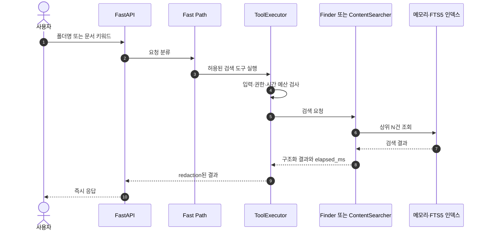
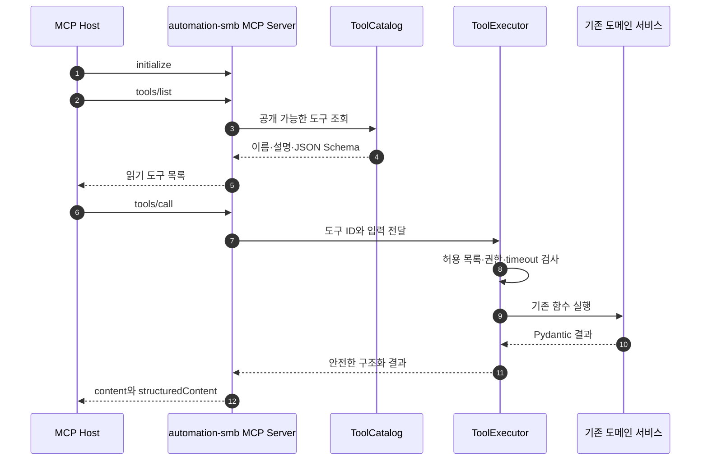
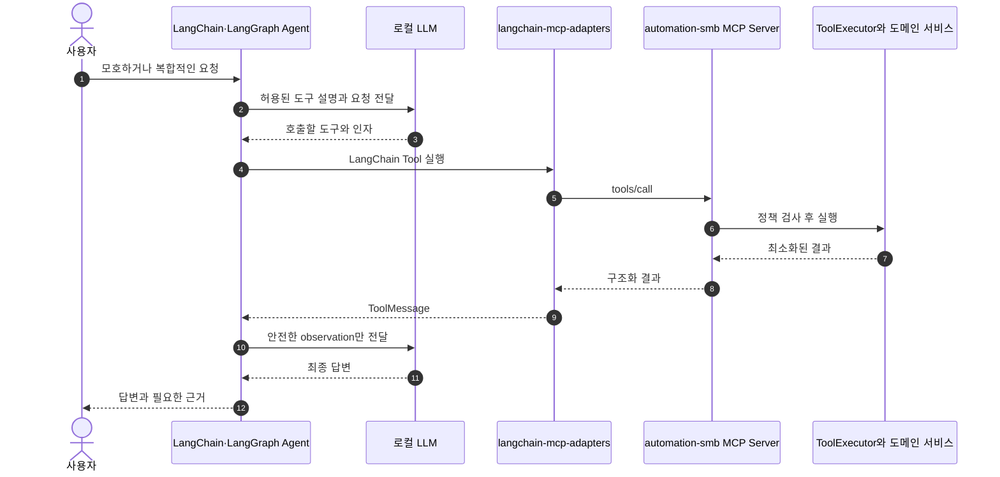
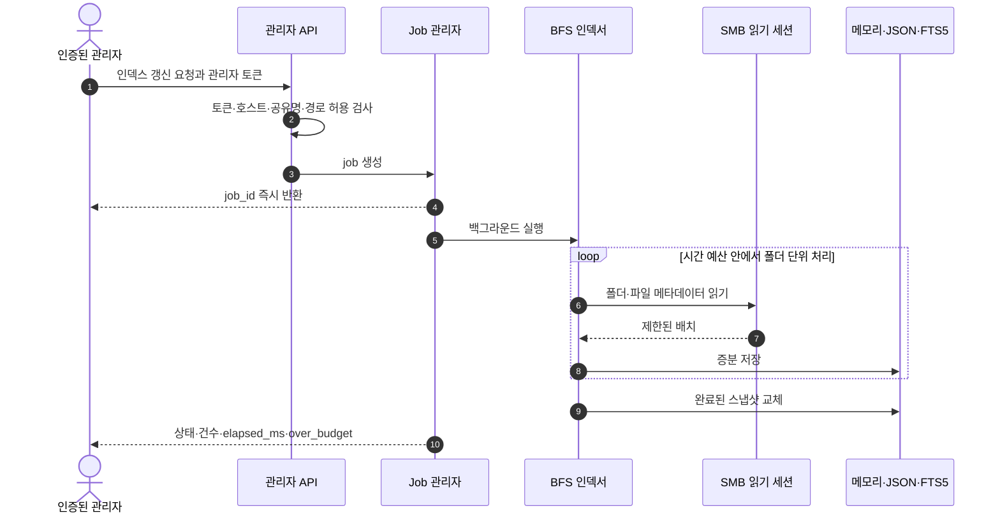

# automation-smb 코드 우선 도구·LangChain·MCP 아키텍처

> 상태: 검색 2개의 공통 계약·executor·catalog 기반 `/mcp` 등록 완료, 나머지 업무 tool 이관 대기 — 이 문서는
> 현재 구조와 단계적 목표를 함께 정의한다. 상세 구현 순서와 검증 결과는
> [MCP_IMPLEMENTATION_PLAN.md](MCP_IMPLEMENTATION_PLAN.md)를 따른다.
>
> 기준일: 2026-07-24

## 1. 결론

현재의 검색·보고서·핵형요약 구현을 LangChain Tool로 전면 재작성하지 않는다. 실제 업무 함수는 프레임워크와
분리하고, 도구 계약과 실행 정책을 하나의 공통 계층에서 관리한다. 그 위에 FastAPI, 자체 Playground,
MCP, LangChain/LangGraph 어댑터를 연결한다.

핵심 원칙은 다음과 같다.

1. **업무 로직은 한 번만 구현한다.** 폴더 검색, 문서 검색, 보고서 후보 검색, 핵형요약 함수는 기존 구현을 재사용한다.
2. **도구 계약과 정책도 한 곳에서 관리한다.** 이름, 설명, Pydantic 입출력, 권한, timeout, 외부 전송 허용 여부를
   공통 `ToolSpec`과 `ToolExecutor`가 소유한다.
3. **MCP는 외부 AI 도구 접근의 표준 경계로 사용한다.** 외부 MCP Host는 `/mcp`에서 승인된 도구만 발견하고
   호출하며, 자체 Playground는 같은 executor를 in-process로 사용한다.
4. **LangChain은 Agent 오케스트레이션에 사용한다.** 단순 검색 fast path에는 LLM을 강제하지 않는다.
5. **관리자·쓰기 작업은 Agent/MCP에서 분리한다.** 인덱스 갱신은 인증된 관리자 API와 백그라운드 job으로만 실행한다.

## 2. 재검토 결과

현재 저장소에는 이미 두 종류의 도구 정의가 존재한다.

- `src/smb_finder/playground/tools.py`: 자체 Playground용 `ToolDefinition`·`ToolHandler`
- `integrations/langgraph/smb_agent/tools.py`: `@tool`로 만든 LangChain 도구가 FastAPI를 HTTP로 호출

따라서 LangChain Tool로 전면 재작성하면 관리가 단순해지기보다, MCP·REST·Playground에 필요한 권한과 결과 변환을
LangChain 주변에서 다시 구현하게 될 가능성이 크다. 반대로 현재 구조를 그대로 두면 도구 이름·설명·입력 스키마가
Playground와 LangGraph에 중복된다.

목표 구조는 어느 한 프레임워크의 Tool 객체를 원본으로 삼는 것이 아니라, 프레임워크 중립적인 공통 도구 계약을
원본으로 삼는 것이다.

| 구분 | 현재 | 목표 |
|---|---|---|
| 업무 함수 | `Finder`, `ContentSearcher`, `reports`에 분리됨 | 그대로 재사용 |
| 도구 정의 | 검색 2개는 공통 `ToolCatalog`, 나머지 Playground/LangGraph 정의는 잔존 | 전체 공통 `ToolCatalog` |
| 보안 정책 | 검색 2개는 공통 `ToolExecutor`, 나머지는 기존 경계 | 공통 `ToolExecutor`에서 집행 |
| LangGraph 도구 | 별도 `@tool` HTTP 래퍼 | MCP에서 동적 로드 |
| 외부 AI 연결 | REST + 로컬 MCP에 읽기 검색 2개 공개 | 허용된 도구만 MCP로 단계적 확장 |
| 관리자 작업 | REST와 일부 LangGraph 도구에 존재 | 관리자 API로만 분리 |

## 3. 목표 전체 서비스 흐름도



이 구조에서 MCP 서버와 LangChain Agent의 역할은 겹치지 않는다.

- MCP 서버는 도구를 표준 형식으로 공개하고 호출을 중계한다.
- LangChain/LangGraph Agent는 사용자 의도를 해석하고 어떤 MCP 도구를 호출할지 결정한다.
- 공통 `ToolExecutor`는 호출 주체와 관계없이 동일한 보안·시간 정책을 적용한다.
- 실제 검색과 보고서 로직은 기존 도메인 서비스가 수행한다.

## 4. 요청 종류별 실행 흐름

### 4.1 단순 검색 fast path

단순 키워드 요청은 Agent나 LLM을 거치지 않는다. 현재 지연 목표를 지키기 위한 기본 경로다.



### 4.2 MCP 도구 호출

MCP는 기존 검색 로직을 대체하지 않고, 외부 AI가 사용할 표준 호출 경계를 추가한다.



### 4.3 모호한 자연어 요청과 LangChain/LangGraph

LangChain은 복수 단계 판단이 필요한 요청에만 사용한다. LangGraph가 현재처럼 별도 HTTP Tool을 유지하지 않고,
MCP 클라이언트로 도구를 동적으로 가져오는 것이 목표다.



### 4.4 인덱스 갱신

인덱스 갱신은 MCP와 Agent의 자동 도구 호출에서 제외한다. 인증된 운영자가 제한된 경로를 지정하고,
백그라운드 job이 SMB를 읽기 전용으로 BFS 순회한다.



## 5. 도구 공개 정책

| 기능 | REST | 자체 Playground | MCP | LangChain Agent | 기본 정책 |
|---|---:|---:|---:|---:|---|
| `find_folder` | 허용 | 허용 | 허용 | MCP를 통해 허용 | 읽기, 상위 N건, 빠른 경로 |
| `search_content` | 허용 | 허용 | 허용 | MCP를 통해 허용 | 읽기, snippet·경로 최소화 |
| `cytogenetics_karyotype_summary` | 허용 | 허용 | 단계적 허용 | MCP를 통해 허용 | 로컬 LLM 고정, 식별정보 금지 |
| `cytogenetics_report` | 선택 허용 | 허용 | 허용 | MCP를 통해 허용 | 후보·체크리스트만 반환 |
| `ngs_report` | 선택 허용 | 허용 | 허용 | MCP를 통해 허용 | 후보·체크리스트만 반환 |
| `refresh_content` | 관리자만 | 자동 실행 금지 | 비공개 | 비공개 | 관리자 job 전용 |
| SMB 쓰기·이동·삭제 | 미구현 | 금지 | 금지 | 금지 | 명시 요청 전까지 제공하지 않음 |

MCP의 `tools/list`에는 해당 사용자와 실행 환경이 실제로 호출할 수 있는 읽기 도구만 나타나야 한다. 단순히
클라이언트 UI에서 숨기는 것으로 끝내지 않고 서버의 `ToolExecutor`가 다시 권한을 검사한다.

## 6. 공통 ToolSpec과 ToolExecutor

### 6.1 ToolSpec

공통 정의가 최소한 포함할 필드는 다음과 같다.

```python
class ToolSpec(BaseModel):
    id: str
    display_name: str
    description: str
    permission: Literal["read", "admin"]
    input_model: type[BaseModel]
    output_model: type[BaseModel]
    timeout_ms: int
    enabled: bool = True
    external_provider_allowed: bool = False
    expose_to_mcp: bool = False
    expose_to_agent: bool = False
```

현재 `ToolDefinition.input_schema`는 UI 설명에 가까운 딕셔너리다. 목표 구조에서는 Pydantic 입력 모델의
`model_json_schema()`를 REST OpenAPI, MCP `inputSchema`, LangChain `args_schema`에 공통으로 사용한다.

### 6.2 ToolExecutor

모든 호출 경로가 다음 정책을 동일하게 통과한다.

1. 도구 존재·활성화 여부
2. 호출자별 허용 목록과 `permission`
3. Pydantic 입력 검증과 길이·건수 제한
4. 외부 provider 전송 허용 여부
5. 도구별 timeout과 전체 시간 예산
6. 중복·재귀 호출 제한
7. 결과 건수 제한과 경로·본문 redaction
8. `elapsed_ms`, `over_budget`, `error_code` 기록
9. 감사 로그에는 사용자·도구·판정·시간만 기록하고 민감 본문은 기록하지 않음

LangChain middleware와 MCP handler는 정책을 각자 다시 구현하지 않고 `ToolExecutor`를 호출한다.

## 7. 권장 코드 구조

현재 공통 계약은 `src/smb_finder/tooling/`, MCP 진입점은 `src/smb_finder/mcp_server.py`, 회귀 검증은
`tests/test_mcp_server.py`에 구현되어 있다. 아래 트리의 `adapters/`와 LangGraph MCP 주입은 후속 목표이며,
기존 파일을 한꺼번에 이동하지 않는다.

```text
src/smb_finder/
├── api.py                         # REST·Playground 라우트
├── finder.py                      # 기존 폴더 검색 업무 로직
├── content_search.py              # 기존 문서 검색 업무 로직
├── reports/                       # 기존 보고서·핵형요약 업무 로직
├── tooling/
│   ├── contracts.py               # 도구별 Pydantic 입출력 모델
│   ├── catalog.py                 # 공통 ToolSpec 등록
│   ├── executor.py                # 권한·timeout·redaction·감사 정책
│   └── adapters/
│       ├── playground.py          # 현재 Agent가 사용할 어댑터
│       ├── langchain.py           # 필요 시 in-process StructuredTool 변환
│       └── mcp.py                 # 공식 MCP Python SDK 어댑터
└── mcp_server.py                  # FastAPI Streamable HTTP MCP 진입점

integrations/langgraph/
└── smb_agent/
    └── graph.py                   # MCP에서 읽기 도구를 불러 Agent에 주입
```

## 8. 단계적 이관 계획

### 단계 1 — 공통 계약 정리 (검색 2개 완료)

- 기존 `ToolDefinition`과 `ToolExecutionResult` 동작을 보존한다.
- 도구별 입력·출력 Pydantic 모델을 만든다.
- 기존 함수 호출을 `ToolExecutor` 하나로 모은다.
- 기존 Playground 테스트를 회귀 테스트로 유지한다.

### 단계 2 — 읽기 전용 MCP 서버 (M0–M2 완료)

- 공식 MCP Python SDK 안정 버전을 사용한다.
- `find_folder`, `search_content` 두 도구만 먼저 공개한다.
- 기존 FastAPI lifespan과 검색 runtime을 재사용하는 `/mcp` Streamable HTTP로 시작한다.
- `MCP_ENABLED=false`, `MCP_ALLOW_REMOTE=false`를 기본값으로 둔다.
- MCP를 활성화할 때 별도 bearer token을 필수로 요구한다.
- MCP Inspector로 `tools/list`, `tools/call`, 입력 오류, timeout을 검증한다.
- 관리자 도구가 목록에 나타나지 않는지 테스트한다.

### 단계 3 — LangGraph 중복 도구 제거 (M3 예정)

- `integrations/langgraph/smb_agent/tools.py`의 수동 HTTP 래퍼를 단계적으로 제거한다.
- `langchain-mcp-adapters`로 automation-smb MCP 도구를 로드한다.
- adapter 0.3 계열이 요구하는 LangChain Core 1.x 호환성 업그레이드는 MCP 서버 MVP와 분리한다.
- 단순 검색은 기존 REST fast path를 유지하고, 모호한 요청만 Agent로 보낸다.

### 단계 4 — 보고서·핵형요약 추가 (후속)

- 보고서 후보·체크리스트 결과에 정식 출력 스키마를 부여한다.
- 핵형요약 MCP 도구는 서버 측 로컬 LLM 설정만 사용한다.
- provider URL, 모델, API key를 MCP 도구 인자로 받지 않는다.
- 합성·비식별 회귀 테스트와 실제 운영 정책을 분리한다.

### 단계 5 — 운영용 remote MCP 검토 (후속)

- 로컬 `/mcp` 검증이 끝난 뒤 필요할 때만 사내망 remote 접근을 연다.
- 사내망 바인딩, 인증, 사용자별 도구 allowlist, 요청 크기 제한을 적용한다.
- PHI가 포함될 수 있는 본문·경로를 감사 로그와 외부 trace에서 제외한다.

## 9. 지연과 보안 기준

| 경로 | 목표 |
|---|---|
| 인메모리 폴더 검색 | 50ms 미만 |
| 인덱스 준비 상태의 텍스트 명령 | p50 300ms 미만, p95 1초 미만 |
| MCP 어댑터 | 검색 로직을 다시 수행하지 않고 호출·검증·직렬화만 수행 |
| LLM Agent | 모호한 요청에만 사용하고 전체 시간 예산 초과 시 부분 결과 반환 |
| 인덱싱 | 사용자 요청 경로와 분리한 백그라운드 BFS job |

보안 불변 조건은 다음과 같다.

- SMB 자격증명과 내부 IP를 도구 계약·로그·MCP 결과에 포함하지 않는다.
- MCP 서버가 SMB를 직접 전체 순회하지 않고 기존 인덱스를 조회한다.
- 원본 공유폴더는 읽기 전용으로 유지한다.
- 관리자와 쓰기 도구는 Agent 및 MCP에 공개하지 않는다.
- 외부 LLM에는 환자·검사 데이터, 파일 내용, 내부 경로를 보내지 않는다.
- `stdio` 서버는 표준 출력에 일반 로그를 쓰지 않고 MCP 메시지만 사용한다.

## 10. 이번 검토에서 채택하지 않은 구조

### 모든 기능을 LangChain Tool로 전면 재작성

LangChain Agent 안에서는 편하지만 REST와 MCP까지 LangChain 객체에 종속된다. 현재의 권한·timeout·외부 전송 정책을
middleware로 다시 구현해야 하므로 공통 ToolSpec보다 관리 이점이 작다.

### FastAPI 전체를 자동 MCP 노출

빠른 PoC에는 사용할 수 있지만 관리자·디버그·외부 provider endpoint가 함께 노출될 위험이 있다. 의료데이터 환경에서는
명시적 allowlist로 등록한 MCP 도구가 더 안전하다.

### LangGraph Agent 전체만 하나의 MCP Tool로 공개

복합 작업에는 유용하지만 단순 문서 검색도 LLM Agent를 통과할 수 있어 지연과 비결정성이 증가한다. 읽기 도구를 먼저
개별 MCP Tool로 공개하고, 필요할 때 별도의 Agent Tool을 추가한다.

## 11. 관련 구현과 공식 문서

### 현재 저장소

- `src/smb_finder/playground/tools.py` — 현재 자체 Tool Registry
- `src/smb_finder/playground/agent.py` — 선택 도구 allowlist, 외부 provider, 관리자 도구 차단
- `integrations/langgraph/smb_agent/tools.py` — 현재 LangChain `@tool` HTTP 래퍼
- `integrations/langgraph/smb_agent/graph.py` — 현재 LangGraph ReAct Agent
- `src/smb_finder/api.py` — 현재 REST 및 관리자 API

### 공식 문서

- [MCP 서버 작성](https://modelcontextprotocol.io/docs/develop/build-server)
- [MCP Tools 명세](https://modelcontextprotocol.io/specification/2025-06-18/server/tools)
- [공식 MCP Python SDK](https://github.com/modelcontextprotocol/python-sdk)
- [LangChain MCP 연동](https://docs.langchain.com/oss/python/langchain/mcp)
- [LangChain MCP Adapters](https://github.com/langchain-ai/langchain-mcp-adapters)
- [LangGraph Agent Server MCP endpoint](https://docs.langchain.com/langsmith/server-mcp)
